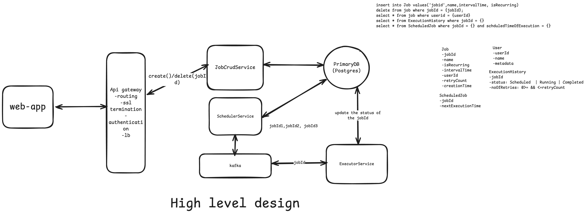
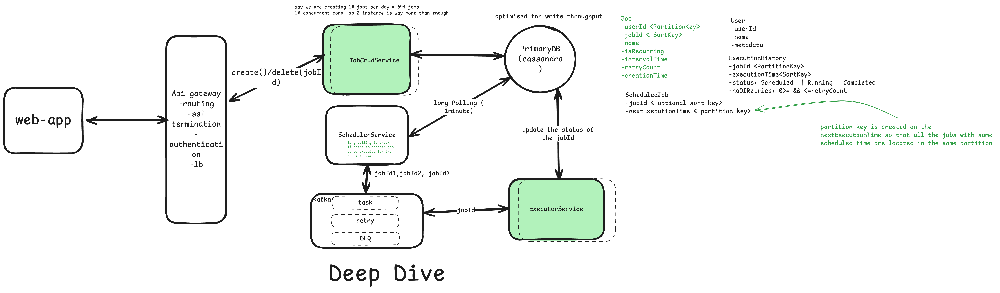
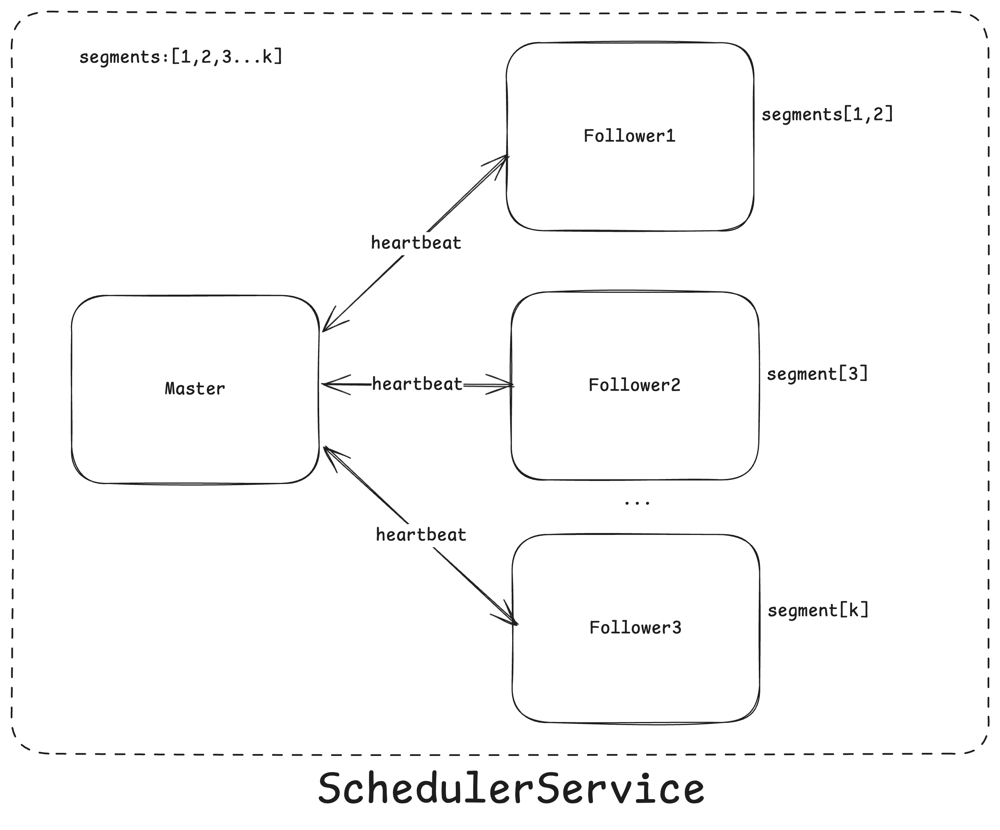
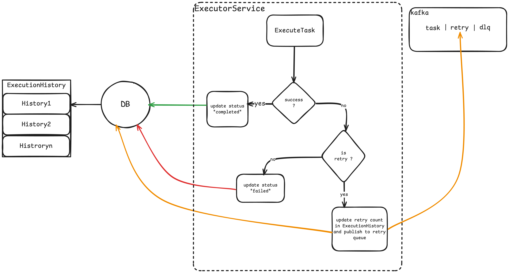

# Distributed job scheduler
### [Reference](https://medium.com/@mayilb77/design-a-distributed-job-scheduler-for-millions-of-tasks-in-daily-operations-4132dc6d645f)

Purpose: Scheduled email, Push notification, invoice generation and other such processes

## Functional requirements:
- create, delete, view jobs created by user (support for both one time and recuring jobs)
- view execution history of a given job
- view list of jobs scheduled for executing next

## Non functional requirements
- Scale Handle 10million concurrent jobs in a day -> 10^7/(24*60)=6944 jobs per minute
- Availability >> consistency i.e the  system should be highly available and
jobs should get executed eventually given the max retry count (hence support for retry failure)

## Entities of the system
Job <br>
ExecutionHistory <br>
User <br>
ScheduledJob<br>


## Api or interfaces of the system

```
//user is authenticated and the authentication token is with the request header
JWT | Session token in header
```

Create job
```
POST /create/job ----> jobId
body:{
    jobName,
    status: created
    isRecurring: true | false
    intervalTime
}
```
Delete job
```
DELETE /jobs/{jobId} ---> 200 http code
```
View jobs for a given user
```
GET /jobs/{userId} ---> List[] job
```
View execution history of a given job
```
GET /jobs/history/{jobId} -->  ExecutionHistory
```
View list of jobs scheduled for executing next/right now
```
GET /jobs/{jobId}/{currentTime} --> List[] job
```
## High Level Design:



### JobCrudService
Create/updated/delete/view list of jobs created by a given user
When a new job is crated and the job is recurring, the JobCrudService calculates the next execution time and updates the ScheduledJob table with jobId and nextExecutionTime

### SchedulerService
Polls the ScheduledJob table every minute to get the list of pending jobs to be executed and puts them onto kafka queue topic say 'task'.
After the task is scheduled (added in the queue) the SchedulerService adds a row in the ExecutionHistory for the given jobId and updated the status as 'Scheduled'


### ExecutorService
Reads off of the kafka queue (the jobId) and executes the job, if the job is executed successfully the status of the job is updated in the ExecutionHistroy as 'Successful'.

If there is failure in the job exection then the executor service will check retry count in the job table, if retry count is >0 then it will the retry count in the ExecutionHistry table and will put the jobId back onto queue ( say in retry_topic) with some backoffTime( that can be configured to increase expontially) and after the backoff time the job is picked up by same/different instace of executor service and is executed if the jobs fails again and again and the retry count is also exausted then the job is put onto a dead letter queue (DLQ) and is not exected again, the status of the job is updated in the ExecutionHistory as 'failed'


## Deep dives



### Handling 10M jobs daily i.e ~7k per minute
Create multiple instances of JobCrudService and have a load balancer between the ApiGateway and the JobCrudService instances to distribute the load evenly across all the instances for all the crud operations

note: This might not be required as the a single network optimized instance can handle 1M concurrent connections but given the server never runs on its full capacity we can have few more instances of the JobCrudService for fault tolerance.

We can also create multple intances of SchedulerService which is responsible for polling list of jobs to be scheduled for execution next, since we can expect close to 7k jobs per minutes, we might want to distribute this load among the instances this will also insure faul tolerance in peak hours, thus we will also avoid single point of failure(that could be the case if we use only single instance and it get overwhelmed with sheduling of the next jobs).
But **this has its own limitation** since we are using many instances of 
SchedulerService, how are we going insure that the same job is not being scheduled by two or more instances (as these instaces could be in different locations and they might not know what other instances have read from the ScheduleJob table)
To fix this we can introduce another column in ScheduleJob table called 'segment' than can have values between 1 to k (integer value) and we can update the partition key as (jobId + segment), each row added in the table can have a random segment assigned to it.
Due to this composite partition key jobs with the same segment no. will be in the same partition.

We can have a master(coordinator) SchedulerService instace that will be responsible for assigning the range of segments to the no. of follower instances (note: segments>=no. of follower instances). These intances will query the SchedulerJob table and specifically in the partition who segment is assigned to them.

The master node on equal interval of time send the heart beat signal to these instaces to check their health and if any of the instaces are not healthy then it will re-distribute the segment again in the available instaces.
This will insure that no two instances are quering the same partition and thus not scheduling duplicate jobs
```
select * from task_schedule where next_execution_time = {currentTime} and segment in (1,2)
```


### Retry flow in Executor service to insure eventual execution the job untill the retry count is exausted




