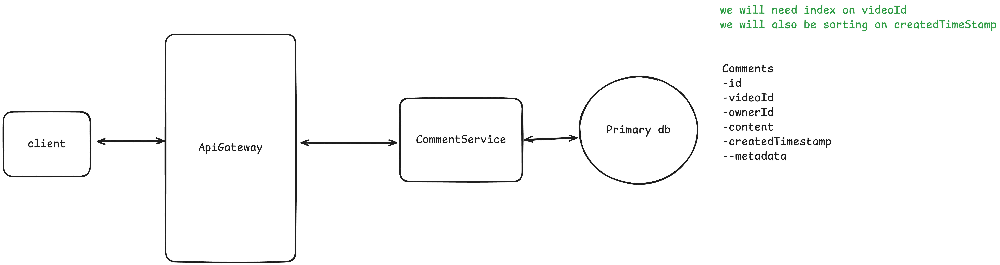
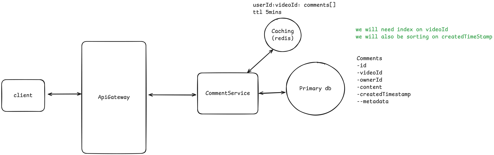
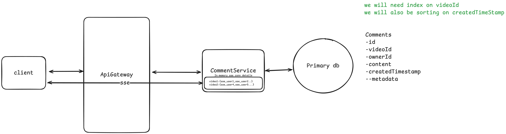
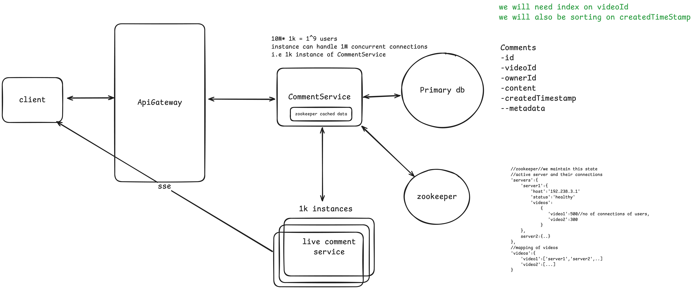
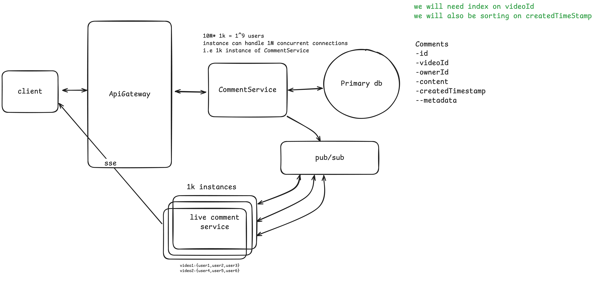
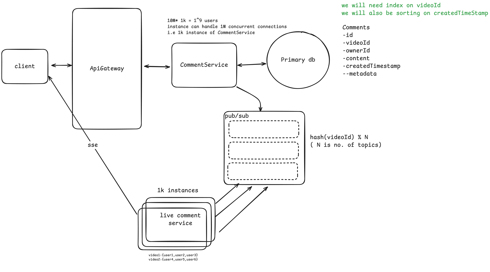

# FaceBook Live comments

Feature of FaceBook where users can post/view comments on live video in near real time
- [FaceBook Live comments](#facebook-live-comments)
  - [Functional Requirements](#functional-requirements)
  - [Non functional requirements](#non-functional-requirements)
  - [Entities](#entities)
  - [API's or Interfaces](#apis-or-interfaces)
  - [High Level design](#high-level-design)
    - [Post a comment](#post-a-comment)
    - [See Live comments](#see-live-comments)
      - [Long polling](#long-polling)
  - [Deep Dives](#deep-dives)
    - [Low latency comment broadcasting](#low-latency-comment-broadcasting)
      - [Web-sockets(Bidirectional)](#web-socketsbidirectional)
      - [SSE (Server Sent Events)](#sse-server-sent-events)
    - [Scale to support millions of live videos and thousands of concurrent viewers](#scale-to-support-millions-of-live-videos-and-thousands-of-concurrent-viewers)
    - [Database optimization and scaling for high write throughput](#database-optimization-and-scaling-for-high-write-throughput)
  - [Questions](#questions)

## Functional Requirements
- User can post comments
- User can see all comments posted in near real time
- User can see all comments posted before they joined
- Out of scope
  - Reply to comment
  - React to comment

## Non functional requirements
- Scale to support 10M live video stream with 1k users on each stream
- Availability > Consistency for comment creation
- Low latency comment broadcast(~200ms)
- Out of scope
  - Security
  - Integrity

## Entities
- User
- Comments
- Video

## API's or Interfaces

Post new comment
```
POST /comment/{videoId}/ ---> 200 (sucess)
body{
    content
}
```
Get new comment
```
GET /comments/{video}/?cursor={lastCommentIdTimestamp}?size={50}?direction=forward--->comments[] 
```
Get old comments(older comments made before the user joined)

```
GET /comments/{video}/?cursor={lastCommentIdTimestamp}?size={50}?direction=backward--->comments[]
```

## High Level design

### Post a comment

**Comment-Service** will all the comment in the db ( simple as that)


### See Live comments

Note: this will require some persistence connection, for low level design we can think of something like Long Polling

#### Long polling

Client queries gateway to ask the Comment-Service every 2/5 seconds for any new comments since the given `lastCommentId`. 
It is simple query like ``select * from comments where videoId = {videoId} and createdTimestamp > {lastCommentIdTimestamp};``

Note: similar will be query to get old comments before user joined with ``createdTimestamp < {lastCommentIdTimestamp};``

***Don't delve too much into below optimization, you might want to briefly mention about below pagination approach via cache and move on, as it is not the focal point here***

Feature of continue to scroll to see comments(old), you scroll up to see last 50 or so n and keep scrolling up to read comments. This is nothing but pagination, and we can achieve pagination here using cache(redis) when we fetch the old comments for the first time we can fetch last 1000 comments and store then in cache and return only 50.

Next time when the user requests for the comments we can fetch the next 50 from the cache itself.
We can keep ttl like 5mins(assumed narrow window within which the users might still be scrolling up) on the cache and have `key` as `userId:videoId` and `value` as `comments[]` sorted order to quickly fetch the comments on a video (`videoId`) and for the user (`userId`)




## Deep Dives


### Low latency comment broadcasting
We used polling in every 2/5 seconds but that will not scale well and will fail to achieve the low latency requirement of <=200ms for live comment broadcasting.

Instead of asking via http long polling again and again we need some sort of persistence connection so that the Comment-Service can tell us whenever there is new comment.
Two popular technologies that can help for persistence connection are websockets and SSE.
Some info on this technologies to make more informed decisions are listed below or you can watch [this](https://youtu.be/LjLx0fCd1k8?t=1672).

#### Web-sockets(Bidirectional)
- Bidirectional
- Not built on HTTP/HTTPS, has its own protocol(built on top of TCP)
  - Hence heavier as it involves handshake to establish connection(this happens between all the involved infra in between like client and Api gateway, Api Gateway and LB if used and then LB and the end point service)
- All infra need to support upgrading from http to web-socket
- Load balancers, Proxies, Firewall all need to negotiate this upgrade

#### SSE (Server Sent Events)
- Unidirectional
- uses HTTP
- Http headers indicating we will be sending chunks
- Just looks like long running HTTP request
- Built in browser support for reconnection



When a new comment comes in say `video1` the `Comment-Service` will quickly lookup in in-memory cache mapping to get connection details of all the users watching the `video1` and will send the comments to those users via SSE

The above solution is good for low latency comment broadcasting but it does not scale very well.

When we horizontally scale the Comment-Service many users will be connected to different Comment-Services and if the comment comes in and lands on service A and viewers/users who are watching that video are connected to service B or C. And now service A does not have sse connections of those users, service A will somehow have to communicate with service B and C to send to comments to those Users.

You see the issue now ?
**This issue is solved in the deep dive of scaling to support millions of live video streaming below**


### Scale to support millions of live videos and thousands of concurrent viewers
How many instance of Comment-Service we will need ?
```
10M live video * 1k avg. concurrent users = 1^9 users = 100cr users
an optimized netwok instance can handle up to 1M concurrent connections (SSE connection in out case)
i.e 1k instance of Comment-Service
```

Most of the users are passive viewers and only few of them are posting comments on the live video.
Hence we can create a different service (`LiveComment-Service`) for handling the broadcasting of live comments so that it can be scaled independently.
`LiveComment-Service` will handle the sse connections of all the concurrent users.

**The same Issue persists here as well**
***When the `Comment-Service` receives a new comment how will it know which `LiveComment-Service` instance should it sent the new comment to ?*** 

**Solution 1(Good): Zookeeper**
A central Dispatcher-Service like **Zookeeper** (it is like a registry service that can be used in service discovery).

`Zookeeper` will keep mapping of all the `LiveComment-Service` and the videos each are responsible for.
So, when a new client want to connect over sse (to get live comments) it is going to request either to `Comment-Service` or `LiveComment-Service` and we are going to ask Zookeeper which `LiveComment-Service` this should subscribe to. Zookeeper will give us host ip address (and other details)


*Zookeeper mapping*

```
//zookeeper//we maintain this state
//active server and their connections
'servers':{
    'server1':{
        'host':'192.238.3.1'
        'status':'healthy'
        'videos':
            {
               'video1':500//no of connections of users,
               'video2':300
            }
    },
    server2:{..}
},
//mapping of videos
'videos':{
    'video1':['server1','server2',..]
    'video2':[...]
}
```


*Flow*
1. `Comment-Service` asks `Zookeeper` , hey I have this new comment for live video1 which `LiveComment-Service` instance should I send this to?
2. Zookeeper will see the mapping and give info back of `server1`
3. `Comment-Service` will send the new comment to `LiveComment-Service` i.e `Server1` and `Server1` will see its in-memory mapping to get the sse details of various users watching a give live video(say `video1`) and finally it will send live comment to those users over their sse connection.

**Disadvantages of this approach**

1. Extra hop Comment-Service will have to ask Zookeeper every time it received an new comment
   1. We can introduce caching of zookeeper mapping in `Comment-Service` 
2. Zookeeper will have to maintain the visibility of various `LiveComment-Service` instances(some will come up other might go down), so Zookeeper will have to send heart beats to keep track of these services and when a new service comes up it will have to register itself with zookeeper


***Use below solution in the interview and its optimization mentioned later***
**Solution 2(Better): Pub/Sub**

Comment-Service receives new comment stores the same in the database (durability)
and publishes/broadcasts the comment in the pub/sub channel/message bus (**we will use redis pub/sub**)
All the instances of LiveComment-Service will subscribe to the message bus/channel and when a new comment for a video is put on the channel all will see the same and whoever has the active users for the give videoId of the new comment will send the comment to those users over sse


Advantage:
- No consistency issue, if some LiveComment-services go down they will loose their sse connections of those users and those users can send request to reconnect and they will get connected to different LiveComment-Service instance
- The job of constantly checking the channel for every single comment that comes in to see if they have mapping for the given videoId in the comment is very CPU intensive task. Hence a lot of wastage of resources here as the overwhelming majority of time it is not going to be a comment(for a given videoId) that they have an active sse connection of client

**Optimization of above approach: Creating Partitions**
(*In redis these Partitions are called Topic and in kafka they are called channel **FYI** this is not that imp* :))

We want them(instances of `LiveComment-Service`) to just listen to what matters 
Something like the hash(videoId) % N (N is not of partitions or topics)
And each of LiveComment-Service instances don't need to subscribe to all the topics they just need to subscribe to subset that they have an active client connected.

In this way they (instances) will only be listening to messages that come in that are for you live videoId or something else that's in this hash grouping.
It is not perfect but it will work.



Note: we can not create partition based individual videoId due to limitations of kafka or in our case redis pub/sub


**Finally Just another observation and/or optimization**
if say only three users are listening/watching a live video we don't want them to be connected to different instances of `LiveComment-Service` and this will require all these 3 instance to subscribe to topics that is getting comments of those videos.

We would want to co-locate them on the same `LiveComment-Service` instance as much as possible.
Ideally we would want all the viewers of the same video connected to the same instance but, this is not possible because if no. of viewers of the video are 160M or more then single instance wont be enough(optimized instance can have at most 1M concurrent connection), in this case we will need at least 160 such instance. But at least it is 160 and not 500k(if we randomly assigns users to different instances).

In case of zookeeper this was bit easier as whenever a new request comes in we will look into the zookeeper mapping and know where everybody else with that videoId is and we would just tell you/client to connect to that instance of `LiveComment-Service`.

In case of pub/sub approach this is bit complex, in nutshell we can another zookeeper or another service and then your API Gateway via layer 7 load balancer(we can put load balancer between client and API gateway to route requests to various Gateways) can have in header what the live videoId is and ask the service (zookeeper or similar service) where should this request be routed and route the request to correct instance of `LiveComment-Service`.

### Database optimization and scaling for high write throughput
We did not talk about db scaling and optimization

```
1M videos * 100 on average comment on each *
(30 min each video and say they are happening one after the other sequently 
= 48 videos daily) 
= 480cr = 4.8 billion writes per day
```
So, we have huge amount of comment write daily.

Given there is mild relation between Comments table, User and video table and our query is straight forward for getting the comments (old/new) we can use sql database(like postgres) but there are databases that are highly optimized for huge writes like **Cassandra** 

So we can query an index for the given videoId and we can use createdTimestamp as our sort key ,we can easily shard on video Id. Cassandra can scale horizontally. 

Cassandra will result in eventual consistency in some places but that is ok given our non functional requirement of eventual consistency of created comments.

## Questions
What did we not use kafka for pub/sub message bus/channel?[know more](https://youtu.be/LjLx0fCd1k8?t=3116)

Because kafka has a lot of overhead to subscribe and unsubscribe from channels and when users are scrolling through feed they are subscribing and unsubscribe to a live video stream very quickly and pubsub in redis makes it a lot more easier as it is in memory hence may be redis is better approach here


