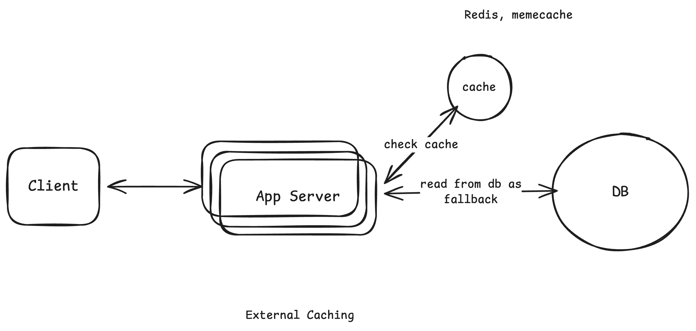
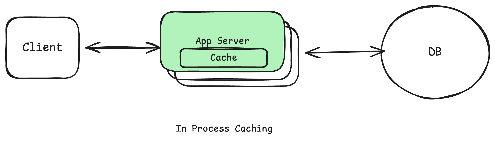
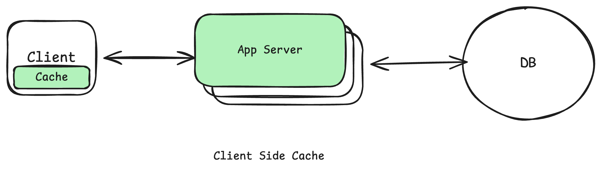
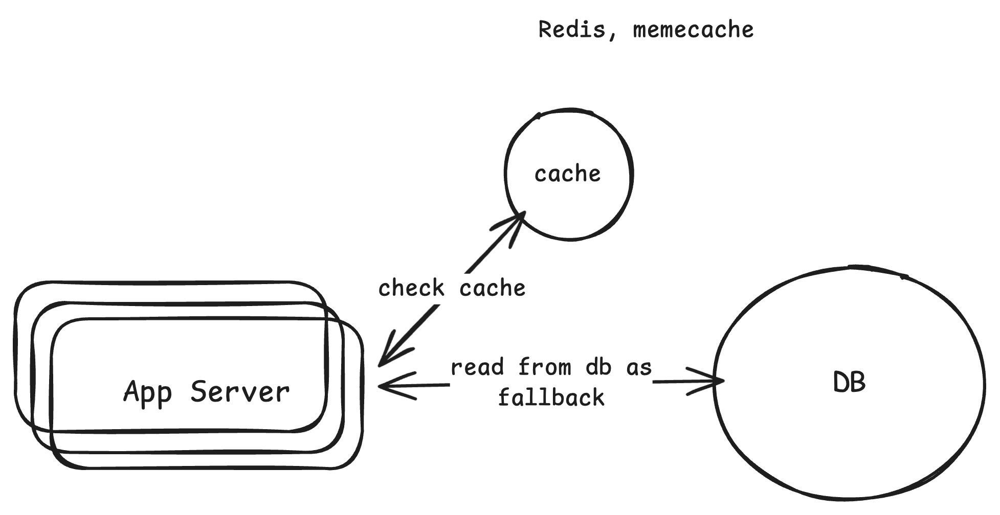
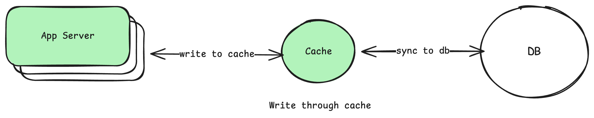
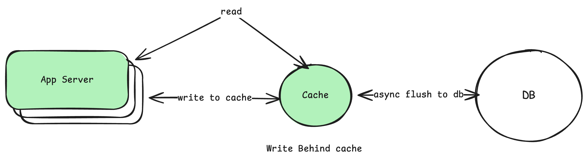
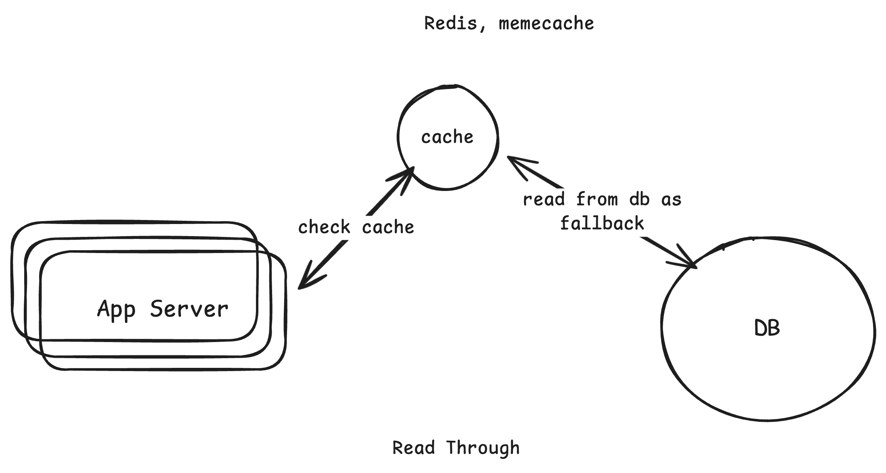
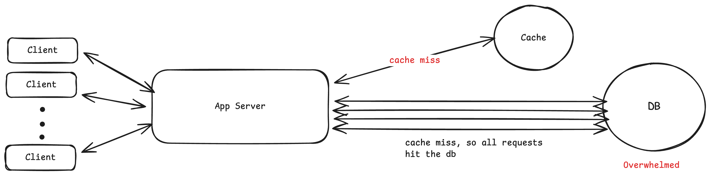
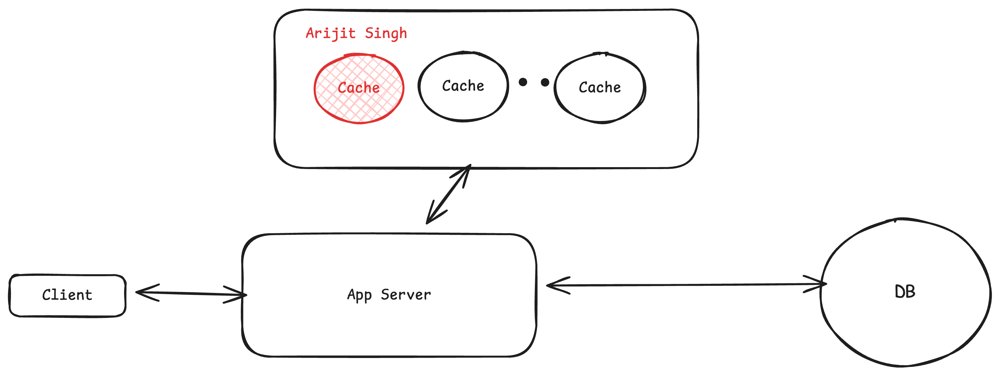
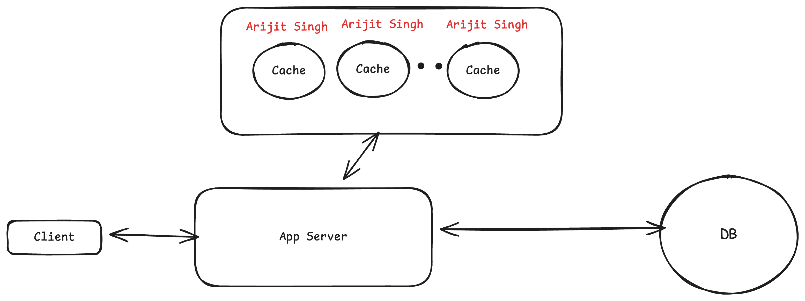

# Caching

    Temporary storage that keeps recently used data handy so you get can get it must faster next time.

## Types
### External Caching
Cache is managed externally (a different server), all the servers(instances of the application) have the same global view of the cache.

### In Process Caching
- Each App server has it's own cache, that means if one server caches something the others won't see it leading ot **inconsistency**.
- Could also lead to wastage of memory (due to **redundancy**).

### CDN (Content Delivery Network)
- Geographically distributed network of servers that can cache contents close to the users.
- Here we are not optimizing for the difference between memory and disk speed, instead we are optimizing for network latency.
- Example if the server is in U.S and the user is in India then the requested data will be fetched from the CDN closet to the user, and if the data is not available in CDN then the CDN will fetch the data from the actual server that is from U.S and then serve to the user.
- data includes but not limited to static files i.e images, videos, PDFs etc.

### Client Side Caching

- Data is cached on the client side, like caching in the web-browser or device that avoids unnecessary network cost.
- For web-apps it will be like HttpCache or LocalStorage and for native mobile apps it will be like storing in the memory or in Disk on the device.
- You have less control over it, like browser cache can be refreshed or disk data can be delete.

## Caching Strategies

### Cache Aside
- Caches only what the user has requested, so the data that the user has never requested will never make it to the cache.
- The only downside is added latency when there is a cache miss and we have to fallback to db to fetch the data, cache the same and return it back to the user.
- This is the most imp Cache strategy for interview perspective.

### Write Through
- Application server write the data directly to the cache and the cache synchronously writes the data in db, unless the data is written in the db the write is not considered complete.
- So, we need a framework of logic that automatically triggers the action of writing the data in db when the cache is updated. Caches like Redis and memecache they don't natively support this feature, so we have to write our own business logic for that.
- **Disadvantages**
  - Wait time for synchronous write in db.
  - Since we are writing everything in cache, we might bloat the cache with data that the user might never need.
  - If cache write succeeds but db write fails, it will lead to inconsistency, this will again add overhead of retry logic, etc.

### Write Behind or Write Back
- The application writes the data to the caches and those are flushed to db in batches in async fashion in the background.
- This makes writes much faster that the Write Through. but if the cache crashes or fails before the data is written back to DB then we will have data loss.
- This should only be used when some data loss is acceptable.

### Read Through
- Same as Cache Aside but instead of application server going to db to fetch the data when cache miss happens, cache itself goes to the db get the data updates the cache and return the data back to application server.
- Same approach is used in CDN

## Cache Eviction Policies

### LRU(Least Recently Used)
- Evicts Items that haven't been used recently. Most common and balanced default.
### LFU(Least Frequency Used)
- Evicts items that are used lest often, even if accessed recently.
- Good for highly skewed access patterns, Like when some data is accessed more than other data (e.g, Celebrity profile viewed on instagram compared to a common person profile viewed).
### FIFO(First In First Out)
- Evicts the oldest item first.
- Simple, but rarely the right choice.

### TTL(Time-To-Live)
- Each item expires after a set time(e.g, 5 minutes).
- Great for data that can go stale, like API responses.

## Common Issues:

### Cache stampede  or Thundering Hurd

If your app is getting 100K read requests per second and you have cached the data that the users are reading with say ttl of 60seconds, so at the 61th second 100K requests will hit cache miss and the 100K request will go to the db overwhelming it and potentially bringing it down.

This is called thundering hurd (this for example happens in the case of Cache aside policy).

### Cache Consistency 
Say the TTL on an entry in the cache is 1 minute but the data is already updated in the db, so the users will read the stale data for the time till the ttl expires and the entry is updated in the cache as well.

This staleness in data is acceptable in some use cases like when user updates their profile picture on FaceBook. It is ok to not see the updated image instantly.
But this staleness might not be acceptable always.

There is no fixed solution for this but there are some workarounds

- Invalidate/remove the entry in the cache when the entry is updated in the database (when consistency is important).
- If some staleness is acceptable (like in case of profile update) we can keep very short TTLs (So that we don't see stale data for a very long time)
  
### Hot keys

Hot Key is an entry that gets way more traffic than everything else.
That single key can become large bottleneck for the system.
That key might be receiving millions of request this may lead to overwhelming that that one node/shard of the cache where this key is located.

Solution:
- Replicate this hot key - put the entry in each of the instance in the cache cluster
  - Now the app server can loadbalance among all the instances 
- Add local fallback cache i.e nothing but in process cache (adding cache with the app server instance itself). This way the request will never hit the cache.

## When should be bring up Caching
 - Read-heavy workload
 - Expensive queries
 - High database cpu
 - Latency requirements

## How to Introduce Caching
- Identify the bottleneck
- Decide what to cache
- Choose your cache architecture
- Set an eviction policy
- Address the downsides