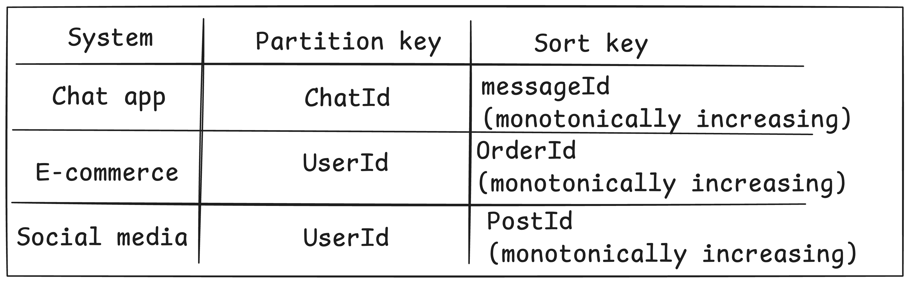
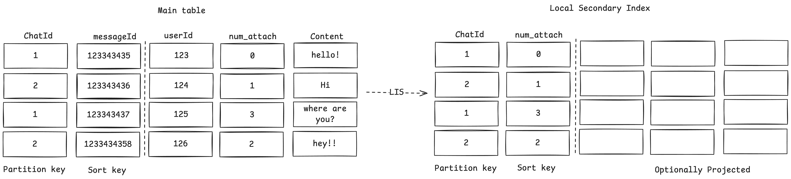
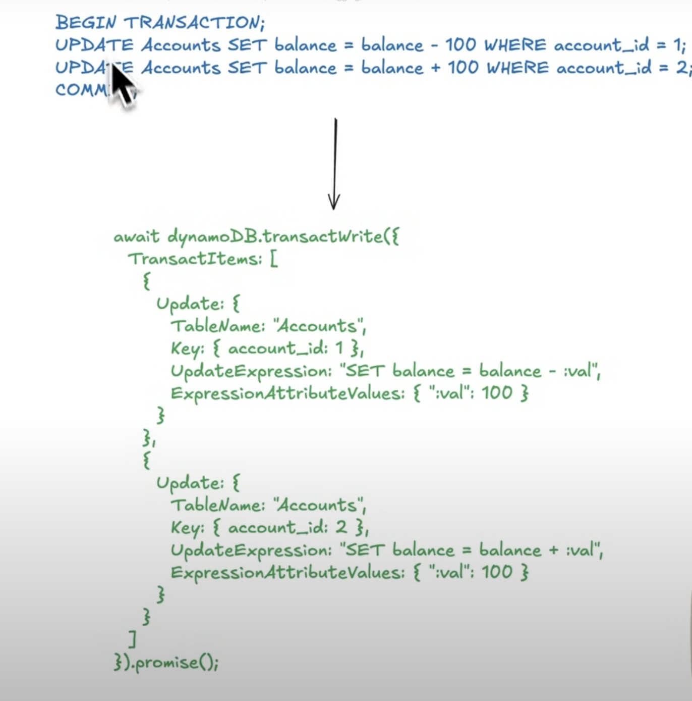
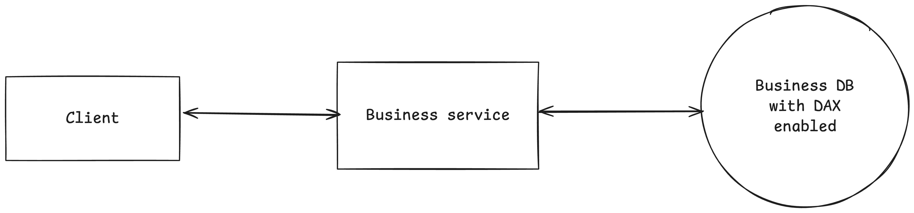
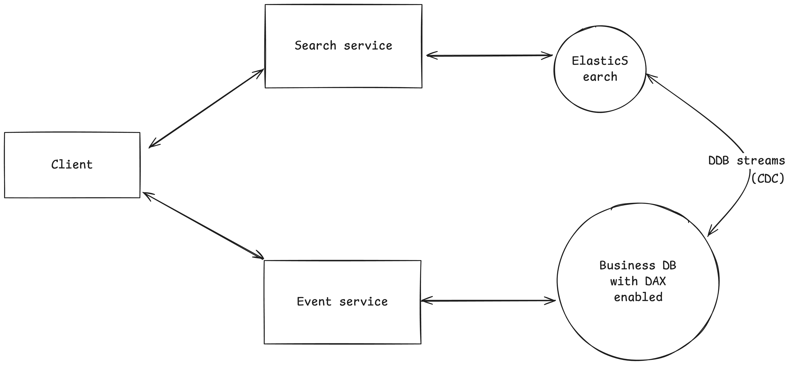

# Amazon's dynamo db

Table: Collection of related data<br>
Items: Individual recods with each unique primary key<br>
Attribute: Actual data field within each Item<br>

## Keys

### Partition key
Uniquely identifies items physical location through hashing, partition key is hashed to get the physical location of the data
### Sort key
(Optional) Attributes to do ordering and range queries within a partition

### Primary key
{Partition key}:{Sort key}

#### Example


What if you have to efficiently query by a different attribute like search for messages created by a user in the given chat Id, in this case we can not rely on the partition key (i.e chatId) and also what if you want to use a different sort key like sorting by time of the messages, or sorting by no. of attachments, for this seconday indexes come into picture

## Seconday Indexes 
### Global Seconday Index(GSI)
Different Partition key from the table to query by an attribute

### Local Seconday Index(LSI)
Same Partition key from the table but different sort key for alternate sorting


## Accessing data
```
dynamodb.query(param,(error, data)=> console.log(data));
```

select * from users -> 
```js
const param ={TableName:'users'}
```

select * from users where userId = 101
```js
param ={
    TableName:'users', 
    KeyConditionExpression='userId=:id',
    ExpressionAttributeValues:{
        ':id':101
        }
    };
```

select * from orders where userId = 101 order by orderDate DESC ->
```js
param ={
    TableName:'users', 
    KeyConditionExpression='userId=:id',
    ExpressionAttributeValues:{
        ':id':101
        }
    ScanIndexForward: false//false for desc, and true for ascending
    };
```

Note : **Transactions** are also supported in dynamoDB now<br>


## Scale through consistent hashing on partition key
Given the partition key passed through the hash funtion and we get a value that we can locate on the ring(0 to 360) and we move in clock wise and the first server we reach would become the server where all the data for the given partition key will reside, if the server is deleted or takeout then the only data that is affected is the data present on the server itself that can be moved to the next server present in the clock wise direction<br>
[Read more about the Consistent Hashing]()
## Fault tolerance
DynamoDB uses asynchronous replication, all the writes comes to a leader node that is resposible for asychronously replicating the data on all the replica nodes present in different physical location/AvailabilityZone(AZ's)<br>
though the writes are going through the leader node, the read can happen from any of the replica nodes, and if the data is not replicated to a replica node then the user might see some stale data which will eventually become consistent.<br>
Eventual consistency is by default enabled for dynamoDb.<br>
But, DynamoDb also supports strong consistency ( all the reads will come from the leader node and you will not see any of the replication lag)


## Advance features
### DAX
In-memory caching layer that provides microsecond response times with read heavy workload withautomatic read/write caching



## DDB streams
Real time change tracking of table modifications (insert, updates, deletes) to trigger downstream processing like lambda functions, replications, or analytics



## When should you use DynamoDB ?
It works most of the time :)
## When should you not use it in an interview ?
- Complex query pattern - DDB not optimized for complex joins and subqueries
- Multitable transaction - DDB has limits on number of items
- Data model complexity - Lots of GSI and LSIs

