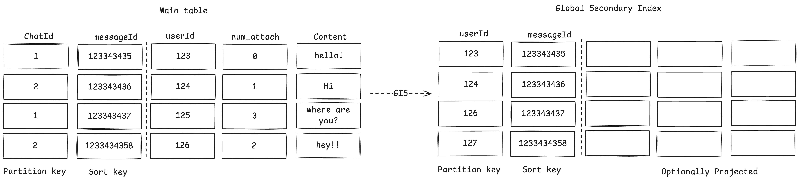

# Amazon's dynamo db

Table: Collection of related data<br>
Items: Individual recods with each unique primary key<br>
Attribute: Actual data field within each Item<br>

## Keys

### Partition key
Uniquely identifies items physical location through hashing, partition key is hashed to get the physical location of the data
### Sort key
(Optional) Attributes to do ordering and range queries within a partition

### Primary key
{Partition key}:{Sort key}

#### Example


What if you have to efficiently query by a different attribute like search for messages created by a user in the given chat Id, in this case we can not rely on the partition key (i.e chatId) and also what if you want to use a different sort key like sorting by time of the messages, or sorting by no. of attachments, for this seconday indexes come into picture

## Seconday Indexes 
### Global Seconday Index(GSI)
Different Partition key from the table to query by an attribute

### Local Seconday Index(LSI)
Same Partition key from the table but different sort key for alternate sorting


## Accessing data
```
dynamodb.query(param,(error, data)=> console.log(data));
```

select * from users -> 
```js
const param ={TableName:'users'}
```

select * from users where userId = 101
```js
param ={
    TableName:'users', 
    KeyConditionExpression='userId=:id',
    ExpressionAttributeValues:{
        ':id':101
        }
    };
```

select * from orders where userId = 101 order by orderDate DESC ->
```js
param ={
    TableName:'users', 
    KeyConditionExpression='userId=:id',
    ExpressionAttributeValues:{
        ':id':101
        }
    ScanIndexForward: false//false for desc, and true for ascending
    };
```

Note : **Transactions** are also supported in dynamoDB now
