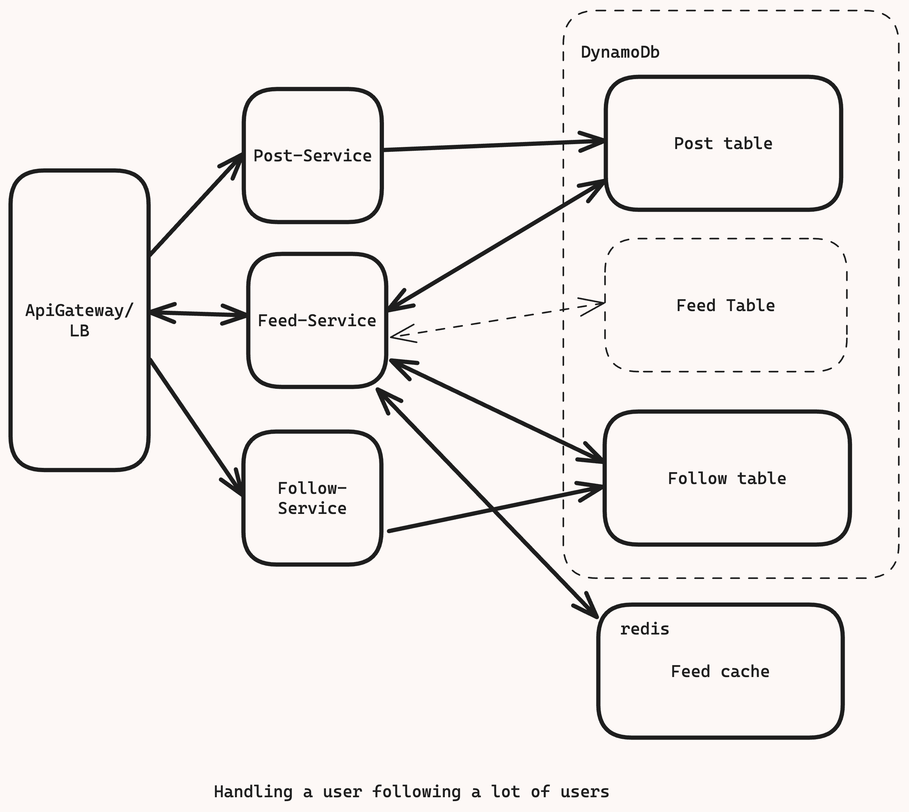

# FaceBook News Feed

[Requirements](#requirements)

[Design constraint](#design-constraint)

[Core entities](#core-entities)

[Api or interfaces](#api-or-interface)

[High level design](#high-level-design)


## Requirements

**Functional**:

- User should be able to post (new post)
- User should be able to follow (follow)
- User should be able to see feed of posts from people they follow
- User should be able to page through their feed

***For the sake of this interview/ or for all the interview we can assume that the user is already authenticated and we have their UserId stored in session or jwt***


**Non Functional**:
- System should be **highly available**,(availability > consistency) eventual consistency with a 
- Posting and viewing the feed should be **fast < 500ms**
- Should be able to **scale**/handle 2B users
- User should be able to **follow unlimited** number of users and User Should be allowed to have **unlimited number of followers**.

## Design Constraint
Hard part of the problem is handling users having huge following/ users that follow huge number of people.

## Core-entities
**User**: User in our system.
**Follow**: A unidirectional relationship between users in the system.
**Post**: A post made by a user in our system, other users following the Owner of the post(another User) should be able to see this post in their feed. 

## Api or interface
Api's are the primary interface using which the user will interact with the system, just define each of your endpoints for each of our functional requirements.

`New post`

```json
POST /post/create
Request:{
    "content":{

    }
}
Response:{
    "postId"://...
}
```
Leave the content blank to account for more reach content or structured data that we might want to add in the post 

`Follow a user`
```json
POST /user/[id]/follow
Request:{

}
```
Follow operation will be binary, we will assume it to be idempotent, so it does not fail even if the user clicks on the follow button twice.

`View feed`

```json
GET /feed
Response:{

}

```
## General flow Optional
## High level design

- **User Should be able to post** and access it via postId
  -   We are going to build a basic flow and add more complexities later on
  -   Since we know we will have to scale later we will put horizontally scaled service behind the **API gateway/load-balancer**
  -   Leaving caching for the deep dive part
  -   We can handle more traffic by scaling horizontal i.e by  addition post-service
  -   User hit API gateway, which sends request to one of the instances of post-service which creates an insert event in db.
  


  -   For **database** we can use key-value store like **Amazon's DynamoDb** for the sake of its simplicity and scalability and we can provision nearly limitless storage provided we spread our load evenly on our partitions
  -   
-   **User should be able to follow** other Users
    - Following a friend/page on facebook is like many to many relationship, we can use another table for this called Follow with `userFollowing:userFollowed` as the primary key.
    - We can create partition on user following to quickly see user's they follow economically, we can also create a secondary index on `userFollowed` to get all the users that follow them.
  


-   **User should be able to view a feed of posts** from people they follow
    -   This has several challenges
        -   Finding all the users the given user follow
        -   Getting all the posts
        -   Showing those posts in chronological order on the feed
    -   We will start with naive approach and we will iteratively improve the design. We will start with the naive solution and solve the scaling problem separately
    -   We have and index on follow table to get the list of users a user follows quickly but we don't have any index on post table to get posts of various users.
    -   We can create a partition key on post table for `userId` and sort key on timestamp of the post this will sort the posts of the user within the partition in chronological order.
    -   Note: partition key on userId will store all the posts from that user in the same partition making it quick to get all the post and sort key on the timestamp will the posts within each users partition by timestamp
  
 

    - Here we have the simple feed service which will fetch all the users the given user follow from the follow table and get all the posts made by those users from the post table sorted on the basis of timestamp and finally
  the feed service will return the result back to user's feed.

    - This simple approach has challenges like
      - Our user may be following a lot of people 
      - Those people may have a lot of posts
      - Total set of posts will be very large due to 1 and 2
    - Before we dive into these complexities let finish the functional requirements first


- **User should be able to scroll their feed**
  - We want to give almost infinite scroll to the user, for this we need to know what they have already seen in their feed.
  - We can leverage the timestamp of the last post that the user has seen (that will act as a cursor in the user feed) to get the list of next set of posts for the user.
  - Since we can tolerate the eventual consistency of 1 minute we can leverage cache to store the list of postIds in latest to oldest fashion for the give user.
  - When the user request for the first time or when the cache is empty we can get all the posts from the follow and post table and store large number of postID say 500 in the cache in ascending order of their timestamp
  - When the user request for the next set of post based on the timestamp received from the feed service we can lookup in the cache and get set of posts that are older than the timestamp received.
  - To ensure that the cache always has the latest posts for the feed of the given user we can keep the TTL lower that the eventual consistency time i.e. 1 min, by this way eviction will happen and new newer post will be added at at start within the eventual consistency window elapses.
  - This satisfies the basic requirements, but very performant or scalable!


## Deep dive

- **How to handle users who follow large number of users?**
  - If a user is following a large number of users, the queries to the Follow table will take a while to return and we'll be making a large number of queries to the Post table to build their feed. This problem is known as "**fan-out**" - a single requests fans out to create many more requests. Especially when latency is a concern.
  - We can think of building the feed when a new post is created(at *write*) instead of building it at the time of *read*(when the feed request comes) i.e **creating a precomputed feed table** instead of querying the Post and Follow table 
  - We can create another table called feed that will only have list of posts for the feed of the given user, i.e. when ever a new post is created we will updated the feed table of userId that follow the given user who created given post. i.e **when a new post is created, we'll simply add to the relevant feeds.**
  - The feed table is list of postIds stored in chronological order (limited to say 200 posts)
  - We can create partition on the userId of the feed and its values will be the list of postIDs in order
  


  All though it improves the read performance significantly, but it introduces another issue, what if a user having huge followers creates a post, then we will have to write to millions of 
  Feeds efficiently. Let us look into that issue next.

- **How to handle users who have huge number of following?**
  - When a user a large number of followers we again have the same fan-out problem.
  - When we create a post, we need to write to million of feed records. Since the we allow some inconsistency with eventual consistency within 1min window we have very little time to perform these writes in feed table.
    - **Bad Solution: SHOTGUT**
      - *Approach*:
        - Do it all at once, in worst case we are trying to write to million of feed with new post entry.
      - *Challenges*:
        - This is basically unworkable due to the limitation of no. of connections that can be made from out single Post-Service and the time limit available(<1min)
        - In the best case when it does work the load on our Post-Services will be uneven some of then will be writing to millions of feed records while some will sit idle.
    - **Good Solution: async worker**
      - *Approach*:
        - Make use of async worker behind the queue
        - Since our system can handle some delay of when a post is created and when it can be available in feed, we can queue up the write requests and have a fleet of workers consumes these requests and update feed.
        - Any queue will work here as long as it supports at least once delivery of messages and is highly scalable like Amazon's Simple Queue Service(SQS) will be great.
        - When ever a new post is created an entry will be added in the queue with the postID and the creator userId, the worker will lookup all the followers of that creator and update the feed record by prepending the postID at the front of the feed record.
      - Challenges:
        - The Throughput of the workers need to be enormous, for small account with limited no. of followers this is not a problem: we will only be writing to few hundreds of feed.
        - But for mega accounts with millions of followers workers have a lot of work to do.
  


  
- How to handle uneven read of posts?

## Tips

## Questions
    What is api gateway? is it any different from load balancers ?
    What is graph database like Neo4j?
    What is partition key of Amazon's DynamoDb?
