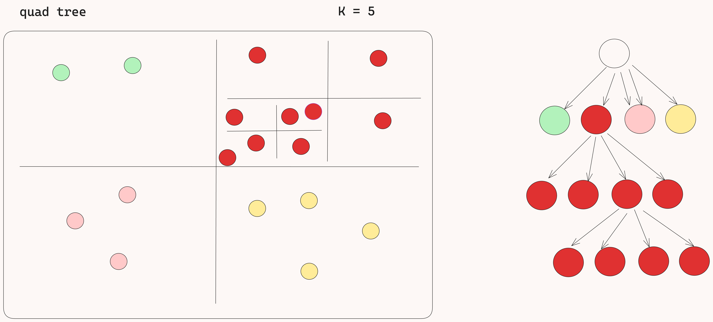
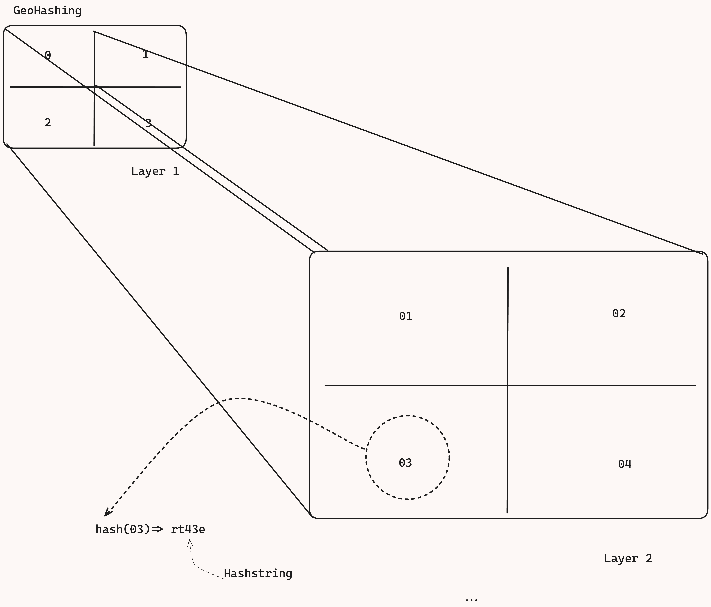

- [Using Postgres for location based queries](#using-postgres-for-location-based-queries)
    - [Issues](#issues)
  - [How to make Spatial(lat,long range) query searches more efficient? in Uber like system in PostGres](#how-to-make-spatiallatlong-range-query-searches-more-efficient-in-uber-like-system-in-postgres)
    - [GeoSpatial Index](#geospatial-index)
      - [QuadTrees](#quadtrees)
        - [Takeaways](#takeaways)
  - [How to reduce the no. of transactions to 4k TPS? for Uber like system in PostGres](#how-to-reduce-the-no-of-transactions-to-4k-tps-for-uber-like-system-in-postgres)
    - [Using Queue to batch the write requests](#using-queue-to-batch-the-write-requests)
      - [Limitation](#limitation)
- [Using In-Memory dataStore for location based query](#using-in-memory-datastore-for-location-based-query)
  - [How to handle Spatial queries using Redis](#how-to-handle-spatial-queries-using-redis)
    - [GeoHashing](#geohashing)
      - [Takeaways](#takeaways-1)
  - [Questions](#questions)
# Using Postgres for location based queries
Can we use postgres database for range queries for latitude and longitude 
example given the latitude and longitude find the nearest drivers in the radius (Uber system design)

In postgres we will have `lat` and `long` column in db (in `location` table note: `lat` and `long` are the locations of various drivers which are frequently changing) and based on the  `lat` and `long` in the input query we will just do range search like find all the drives which are within the bound (4 bounds left ,right, up and down (in 2d space)) of given `lat` and `long`

### Issues

- **Performance**: Since we will have to build some sort of index for quick search and the index we will build is `B-tre`e, and `B-tree` are optimized for one  dimensional data but the `lat` and `long` are inherently two dimensional hence the `B-tree` will not be optimized and it will also require scanning a large amount of rows for wider queries say now we have a region of `20 kilometers` then we will have to scan tons of rows to get the data which is bad.
- **Scalability**: postgres can handle `2 to 4k` transactions per second, that can change by read replica or optimized hardware but that still not be enough to handle let say `600k/sec` transaction (Given that we are designing Uber where `6M` are total drives and `3M` are active and each drives updates their location every `5` second, then it will make `600k` requests/second ).

## How to make Spatial(lat,long range) query searches more efficient? in Uber like system in PostGres

### GeoSpatial Index
Makes querying Spatial(*related to occupying space*) data much more efficient example of GeoSpatial Index is `QuadTrees` ( in `PostGres` we have this which is called `PostGIS`) or `Geohashing` in `Redis`

#### QuadTrees
The `QuadTree` works is we have a map and some `k` value, we recursively divide the map into `4` parts and if any of the part has more Drivers(in case of UBER) then we again divide that region into `4` parts and so on until the no. of drivers in the region and less than `k`.

So when you have to query (no of drivers in the given region based on `lat` and `long`) you simply walk down the tree till you hit the leaf node and it will be list of drives(in case of UBER) that are present in that region.

**Pros**:
Hierarchical structure is efficient for Spatial data indexing
Support fast retrieval
Best suited for bounded box and Spatial queries
Precision is consistent across the map
**Cons**:
More complex than GeoHashing
More computation
More space for using structure and pointers

##### Takeaways
QuadTree is great when you have uneven distribution or uneven density of locations (like businesses in YELP) and you don't have high frequency of writes (as the case in YELP like system)

## How to reduce the no. of transactions to 4k TPS? for Uber like system in PostGres

***We know from the earlier assumption that we can expect somewhere around 600K TPS in the DB but PostGres at max can handle 4k TPS, so in order to handle 600k write requests(of location updates) we can use queue***

### Using Queue to batch the write requests

`Queue` can be introduced between `service` that handles the location update request and the `db`.

So requests can be batched in the queue and at a time `4k` requests will be updated in the db.

#### Limitation
Since we are not immediately updating the location in the db, the **live locations of the drives will be mildly inaccurate**.

Whenever we update the location in the db, the 
**GeoSpatialIndex** (QuadTree in this case) **need to be updated again and again**.

***Hence it is ok but not a great option***

# Using In-Memory dataStore for location based query
We can use in-memory datastore like redis cluster which can handle anywhere between 100K to 1M writes /second (when well optimized) (this solves the issue of handling 600K/s write request of UBER)
## How to handle Spatial queries using Redis
Redis also support GeoSpatial Index called GeoHashing

### GeoHashing
- Very similar to QuadTree but does not require additional data structure storage for index which is a tree(as required by QuadTree)
-  We recursively split the region into 4 parts (the split is independent of density factor K)
-  We split until we get to a precision value that we are happy with
-  We end up with base 32 bit encoding of the `split value string` (hashvalue) like `fhehd4erere`, the longer the string the more precise
-  So we can look at the first,or second or third character of the hash to decide the larger region where the result lies in(in case of Uber it is the drivers location)
-  Redis supports GeoHashing out of the box

**Pros**:
Easy to calculate(hash)
Easy to store(it is just a string)
It does not require any additional data structure 

**Cons**:
Not good for uneven density

#### Takeaways
It is independent of density, it is less good when you have un-even distribution of density of locations but really good when you have high frequency of writes (like in UBER where driver location are updated very frequently)
## Questions
What is B-trees and how B-tree Indexes are created?

