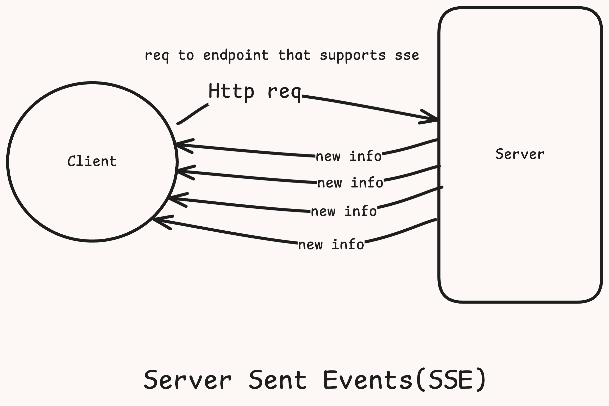

# Server Sent events

It is Unidirectional persistent connection (from server to client)
If the client has to talk to the server it will has to do so with a different protocol

- Client Requests Data from Server Using HTTP:
The client initiates an HTTP request to the server, typically through a GET request targeting an endpoint that supports SSE.

- The Requested Webpage Opens a Connection with the Server:
This connection is kept open by the server. Unlike regular HTTP requests, which are closed after a response is sent, the SSE connection remains open so that the server can send data continuously.

- The Server Sends Data to the Client Whenever New Information Is Available:
The server pushes updates to the client as they become available without the client needing to make additional requests. The server sends data in text/event-stream format, which the client can parse to update the webpage dynamically.

