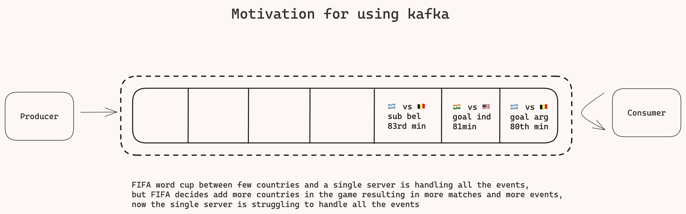

# Kafka deep dive
---


---


---


---


---


---

### Terminologies
**Brokers**: Servers(physical or virtual) that hold the "queue".
**Partitions**: The "queue" an ordered, immutable sequence of messages that we append to, like a log file. Each broker can have multiple partitions.
**Topics**: Logical groupings of partitions, you publish to and consume from topics in kafka.
**Producer**: Write messages/records to topics.
**Consumer**: Read messages/records off of topics.

---

### Message/record structure:
- Header
- Key
- Value
- Timestamp

---

### Create Producer and send message to kafka partition
- create producer
- specify topic param
- specify message object having (key, value) pair
- send
- Kafka assigns the message to correct topic, broker, and partition.
- There is a controller in kafka cluster that keeps mapping of brokers for each partition
- Messages are appended to partition via append only log file
- Each message has an offset, consumer consume message by specifying the offset of the message that they last read


### Consumer reads next message based on offset
- Kafka maintains the latest offset of message that was read.
- Consumer reads message by offset, kafka gives the latest message to read.
- Consumer commits offset after successfully consuming the message back to kafka, in case of failure resume reading from the last committed offset.

---

### To ensure durability and availability kafka has robust replication:


**Leader** replica handles all the read and write (note assignment of leader is done by some cluster controller in kafka).
**Follower** do not handle read/write but passively replicate data from the leader( they can be present on the same or different brokers), they are ready to take over if the leader goes down. There are there to insure durability and fault tolerance.
**Consumer groups** ensure that the messages are read only once by the consumers.


**When to use kafka**:
- Anytime you need messaging queue
  - Processing can be done asynchronously, example: youtube transcoding
  - Transcoding is the process by which youtube's transcoder creates various versions of the uploaded videos like 144p,366p,480p and stores them back in the s3, So this is done asynchronously.

- In-order messaging processing,Example: ticket master waiting queue

- Decoupling producer and consumers when you want to scale them independently,example Leetcode or online judge.
- Anytime you need stream, need to process a lot of data in real time like add-click aggregator
  - When a user clicks on an add, the event is added in the kafka and then some consumer like flink will aggregate all of these events and send it the ad-owner like nike to let them know how many times their add was clicked.
  - Another example would be stream messages in pub-sub setting like facebook live.
  - Other examples are like crickbuzz, web-crawler,etc. 


---

### What you should know about kafka for deep dives

---

## Scaling
- Aim for <1MB message size to avoid overwhelming network or memory.

- Good baseline to make back of the envelop estimation is 1 broker can store 1tb of data and process 10k messages/second.
  - Do math during the the estimation and see if your requirements can be handled with 1 broker if yes then we don't need to scale :).
  - 
**In case you do need to scale**
- Adding new brokers(meaning add new servers leading to more memory, more compute capacity meaning you can process more messages)
- Choosing a good partition key, as bad partition will lead to creation of hot partition.
  - How to handle hot partition ?
    - Remove the key, in doing so you will randomly distributed the messages across the partitions, this is good when we are not concerned about the ordering of messages like in add-click aggregator.
    - CompoundKey, take the partitionKey:N, example: addId:N (where N is 1-10, this will insure that the messages  are distributed among 10 partitions) or addId:userId (this is example of add click aggregator and the add is for NIKE)
    - Back pressure: slow down the producer

---

## Fault tolerance
[How durability is ensured in kafka?](#to-ensure-durability-and-availability-kafka-has-robust-replication)

It creates leader and follower queue for each queue in a given topic,and we can set policies to sync messages between these leaders and followers, as soon a leader goes done the follower will take its place.
The leader can wait for the sync ack from all the followers of it or it can wait for ack from some of the followers before it keeps going. Lesser the no. of acks it needs lesser will the latency of kafka and more the no. of followers synced with the leader queue more will be durability percentage.
```
Default replication factor is 3
acks(acks=all) > will affect latency but increase durability
acks(acks=fewer) > will increase latency but will affect durability 

```
*Note: kafka does not go down because the durability is guaranteed.*

**What if the consumer goes down?**
- Just read the latest offset
  - Consumer reads a message and commits the offset(of the read message) back to kafka, example if the consumer reads a message with offset 100, it tells kafka it read message 100 and if it goes down before committing 100 back to kafka it will read the same offset back from kafka when it comes back up.
- If a consumer group, re-balance
  - All the consumers in a groups are responsible for different ranges of partition, hence if one of the consumer goes down, then range re-balancing happens between the remaining consumers in the group
  - This is handled by kafka cluster as it updates the new ranges to the consumers.
  - It is very important to know when to commit the offset back to kafka (read web-crawler how and when it commits the offset back to kafka as it does once the html is persisted in the s3 bucket)

---
## Failure and retries

**Producer retries**:
kafka producerAPi has some configuration that we can set if there is some failure or error while trying to add messages to the queue

```js
const producer =  kafka.producer({
    retry:{
        retries:5 //(or some other value)
        intialRetryTime:100 //( wait for 100ms before trying to send message in queue again)
    },
    idempotent:true// it insures that the messages are only sent once in the queue 
})

```
**Consumer retries**:

*What if there is some issue at consumer side?*

Like in case of [web-crawler](https://github.com/prashantRmishra/System-design/tree/main/web-crawler#ensuring-fault-tolerance1st-non-functional-requirement) if the the URL that the crawler is hitting is down/not responding, in this case we can have in-memory timer for back off before we try again, but what if the crawler fails it self, then the timer will also be lost. We need some efficient way for exponential back off. We can use kafka for that( but kafka does not support exponential back off out of the box).
We will have to implement some sort of logic for the backOff, like if the URL is down set the backoff time to 30s and put the msg back in retry queue and any other consumer/crawler reading from the retry queue will retry after the backoff time, and if it still fails then the crawler will updated the backoff time exponentially like 1min, 2min, etc. and put it back in the retry queue.
We don't want to try infinitely, once we have retried for let say some threshold no. of times we will remove the URL/message from the retry queue and put it in a Dead Letter Queue( DLQ) and no consumer will read from that queue.

---

## Performance optimization
- Batch messages in producer
  - This way we will have fewer request on whiling adding in kafka queue
  - we can create batch based on maxBatch size (like 100Bytes, once the batch size becomes 100Bytes we push messages in the queue) or maxTime (like if the maxTime is set to 10s once this is elapsed all the messages that has been aggregated in this time period will be pushed on the queue as batch message)
- compress messages in producer
  - kafka provides feature of compression before the message is pushed onto the queue resulting in increased throughput

---

## Retention policy
-   How long are we going to keep the messages before we purged them
    - Two settings
      - retention.ms (default 7 days) -  how long to keep the message in milliseconds
      - retention.bytes(default 1GB) - what is them maximum size when reached messages should be purged


---


