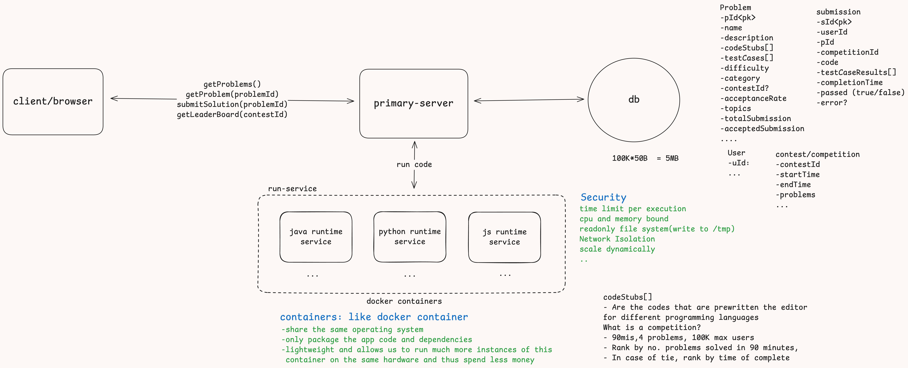
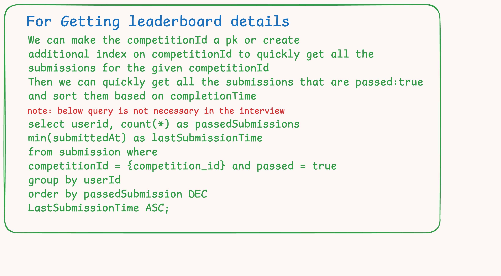
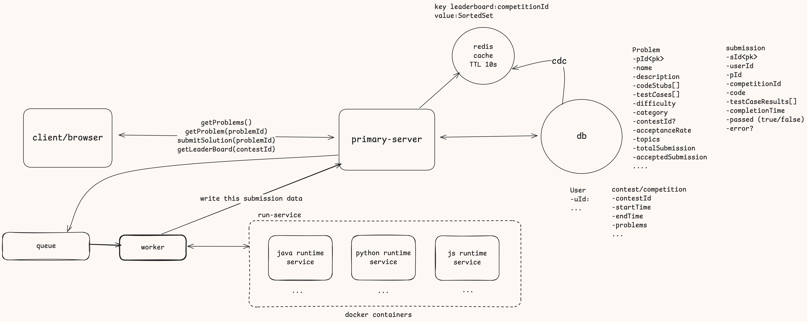

# LeetCode System Design (Online Judge)

### Table of Contents

- [LeetCode System Design (Online Judge)](#leetcode-system-design-online-judge)
    - [Table of Contents](#table-of-contents)
  - [Requirements](#requirements)
    - [Functional](#functional)
    - [Non functional](#non-functional)
      - [Scale of the system](#scale-of-the-system)
  - [Core Entities](#core-entities)
  - [API or interfaces](#api-or-interfaces)
  - [High level Design](#high-level-design)
    - [Network Isolation to run the code submitted by the users](#network-isolation-to-run-the-code-submitted-by-the-users)
      - [Security of docker containers](#security-of-docker-containers)
  - [Deep Dives](#deep-dives)
    - [Near realtime/live leaderboard ranking of the competitions](#near-realtimelive-leaderboard-ranking-of-the-competitions)
      - [Expensive Query problem](#expensive-query-problem)
      - [Using cache with TTL](#using-cache-with-ttl)
      - [Using cache and crone job](#using-cache-and-crone-job)
      - [Update cache on the fly](#update-cache-on-the-fly)
      - [Sorted set in redis cache](#sorted-set-in-redis-cache)
    - [Availability \>\> Consistency](#availability--consistency)
    - [Isolation to run user code](#isolation-to-run-user-code)
    - [Scale to support 100K or more users during peak times like during](#scale-to-support-100k-or-more-users-during-peak-times-like-during)

This structure provides a clear, navigable hierarchy for the detailed markdown content.
## Requirements

### Functional
- See list of problems
- See details of problem and code solution
- Submit a solution and get feedback
- Support competition with leaderboard

### Non functional
- Availability>> Consistency
    Eventual consistency for new problems created on the app
    Other features like viewing a problem, writing code, submitting and getting feedback
    should be highly available
- Isolation of code (during run)
- Scale to support 100K or more users during peak times like during 
competitions.
- Near realtime/live leaderboard ranking of the competitions
- Low latency in terms of feedback for the problems submitted

#### Scale of the system
- 100K DAU
- 100K peak users
- 5M total accounts
- 3k Problem


## Core Entities
- User
- Problem
- Submission
- Contest/Competition
- Leaderboard?(may not be required, if we do just aggregation of submission then that will become the Leaderboard)

## API or interfaces

See list of problems
```
GET /problems?category={}?difficulty={}?page={}?size={} -> List<Problem> (Partial list)
```

See details of the problem and code solution
```
GET /problems/{problemId} -> Problem
```

submit solution and get feedback
```
header: JWT | session
POST /submit/{problemId}  -> submission ( object is returned back)
{
    contestId?
    code
    language
}
```

see leaderboard
```
GET /leaderboard/{contestId}?page={}?size={} -> Leaderboard Object
```
## High level Design



For getting leaderboard by executing expensive query


### Network Isolation to run the code submitted by the users
We can't leave it for **deep dive** because this is really important even in the high level design, we can not execute the user code on the primary server that is  connected to the system, as don't know what sort of code user has submitted

- It could be malicious 
- It might ddos the system
- It might get unauthorized access of the db
- other potential threats

For Network Isolation we can use something like **docker containers**

- Share the same operating system
- Only package the app code and dependencies
- Lightweight and allows us to run much more instances of this
 container on the same hardware and thus spend less money

#### Security of docker containers

- Time limit per execution
- Cpu and memory bound
- Readonly file system(write to /tmp)
- Network Isolation, the containers should not be connected to db
- Scale dynamically
## Deep Dives


### Near realtime/live leaderboard ranking of the competitions

#### Expensive Query problem
Currently we are running the expensive query to get the details of all the users in a given competition and aggregating to create the leader board, the query is expensive in terms of time as well as money 
If we are using postgres db this query will take couple of seconds to run and return the results and given we are expecting nearly 100K users in peak time, a lot of users will query to get the leaderboard details.
Expensive money wise if we are using db like Amazon's DynamoDb then for each such query executed will cost most money.

**Solutions**
#### Using cache with TTL 
- You get the request, you run the expensive query and store the result in cache with TTL 10s
```
key:leaderboard:competitionId
value:json blob// db response of the expensive query in json format that us used to create leaderboard
```
- Pretty soon the leaderboard in the cache will become stale as the submissions will change in db, and one unlucky user that will hit the cache at 10th second will invoke the query again and details will be fetched and will be added in db again.
  
#### Using cache and crone job
- To handle the issue above we can introduce a crone job that will run every 10s and will query db to get the details of new submissions for the competition and update the cache
- This is fine and will work but adding crone job will add extra layer of complexity and the users will still see the stale data for 10s but we can not reduce the crone job time further more as it might overlap with the actual time required for the db for execute the query in that can before the db execute one request the crone job will send another request which is not good.
#### Update cache on the fly
- Better solution would be to update the cache on the fly, i.e once we get a submission from a user we do cheap query like how many submissions have they had and what was the time of their last submission, we can go ahead and updated only those details in the cache
- Since redis is single threaded it can handle race conditions
- Certain complexity will be introduced to handle consistency between the cache and the db that could be handled like insuring once the cache is updated db is also updated with the same details, fault tolerance of cache to insure no data loss (replicas)
  
#### Sorted set in redis cache
```
key:leaderboard:competitionId
value:SortedSet
```
- Even better solution would be to use SortedSet in the as values in the redis, sorted set will have score and attribute on which sorting can be performed and we can have another element/attribute like userId.
- This will allow us to do range queries for the pagination of the leader board, like getting only 100 users sorted on the score.
- So when ever user does a successful submission we updated the db and get the details of their last submission time and accordingly calculate the score and updated the score detail of the user in the cache.
- we can use CDC(change data capture) to insure the consistency between db and the cache.

**Near realtime update of the leader board**
- We can use something like SSE(server sent events) where server can keep on sending the update as and when it receives any to the page leader board page that the user has opened or we can also think of web-sockets.

- But using SSE or web-sockets might be over engineering as they come with significant drawbacks like more complexity and additional infrastructure that needs to be maintained.

- Simple solution will be to use long polling despite how simple it sounds but delay of 2 to 3 seconds is alright given the overhead we will be avoiding by using this simple solution that does not require any additional infra.
So, we(user) can keep polling to get the latest updates of the leaderboard page which we(user) are looking at.

### Availability >> Consistency
Design implemented so far itself prioritizes availability we don't have any locking/acid property use case in our system
Of course we will have basic stuff like Load balancers between ours servers that will be scaling horizontally 

### [Isolation to run user code](#network-isolation-to-run-the-code-submitted-by-the-users)


### Scale to support 100K or more users during peak times like during

This is also part of availability of the system
There is a chance we might not be able to scale the docker containers (running on a server ) fast enough to handle huge influx of user submission, in that case we might start dropping user submissions, which is not good at all.
What we can do is we an introduce some queue like kafka that will queue the user submission and a worker will read off of the queue and send the submission  request to the container that will run and give response back to the worker and the worker will send the response back to the primary server that will do the rest part as we discussed.

We can do some durability configurations of the kafka side to insure durability and the workers can also scale horizontally to keep up with the write to read from the queue.

**Note**: *We don't want to store huge chunk of user code on kafka queue directly, instead what we can do is we can store the user code on s3 and add its link instead on the queue, this way the worker can get the code from the s3 and send it to the container for execution.*

One issue is we have made the process fully asynchronous meaning the user will have know way of knowing if there submission where success or not as the some will be elapsed in the queue the worker will take some time to read off of the queue and containers will take there own time to run and given response back to worker and so on.
it might take couple of seconds to 5 seconds or more.
What we can do is we can use the same approach we did in leader board i.e we can use long polling for up to let say 5s (before showing error) where the user will send request and will keep long polling to check if the `submissionId` is updated in the db or not.
Once it is updated in the db then server and can return response if submission was success or failure.
for the long polling another get request needs to added in the 

[API or interfaces](#api-or-interfaces)

```
GET /submit/{problemId}/submission/{submissionId} --> Submission
and the original POST request earlier (POST /submit/{problemId}) will only get a response like 200 after submitting the code for judging.
```

