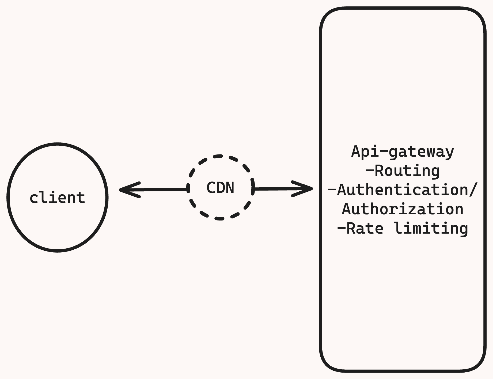
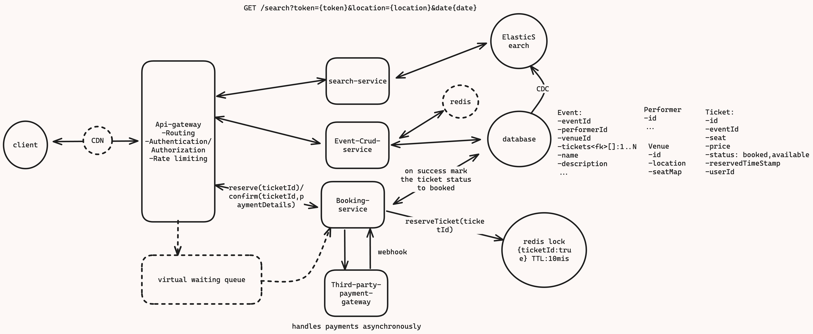

# [TicketMaster/BookMyShow system design](https://www.hellointerview.com/learn/system-design/answer-keys/ticketmaster)
It is an online platform that allows users to purchase tickets for Concerts, Sport events, Theaters, and other live entertainment.
Has ~100M DAU


- [TicketMaster/BookMyShow system design](#ticketmasterbookmyshow-system-design)
  - [Requirements](#requirements)
  - [Core entities](#core-entities)
  - [Api or interfaces](#api-or-interfaces)
  - [High Level Design](#high-level-design)
    - [Issues](#issues)
  - [Deep Dives](#deep-dives)
    - [Improve event search Latency](#improve-event-search-latency)
    - [Scalability: How to handle huge surge in Users](#scalability-how-to-handle-huge-surge-in-users)
    - [How to Improve availability](#how-to-improve-availability)
    - [Caching](#caching)
  - [Questions](#questions)

---

## Requirements

Functional Requirements
- Book ticket
- View an event
- Search for events

Out of scope Functional requirements
- Adding events( admin will be adding event, this out of scope for this system design)

Non functional requirements
- **Strong Consistency** should be favoured for booking tickets (no double booking)
- **High Availability** should be favoured for searching and viewing events
-  **Minimum search latency**
-  **Scalability** to handle surges of from popular events

Out of scope Non functional requirements
- GDPR compliance
- fault tolerance
- etc

---

## Core entities 
(It is nothing but the **data this is persisted** in the system and is exchanged between the **APIs**)
- Event ( Details of the event)
- Venue ( The place where event will be held)
- Performer ( The detail of the artist who will be performing)
- Ticket ( Ticket for the given event) 


<div style="border: 2px solid green; padding: 10px; font-weight: bold; font-style: italic;">
💡 I not gonna list key fields and columns yet because I don't know them yet, I am too early in my design they are going to evolve naturally, when we will go on ahead in deep dives/high level design we will be more clear on exactly the fields that matter
</div>

---

## Api or interfaces

**Search for event**
```json
GET /search?token={token}&location={location}&date{date}
///Response: list of events with limited amount of information on the event

```
**Get Event details**

```json
GET /event/:eventId
//Response: event details like venue, date, performer, ticket[] (list of available tickets) etc.
```

**Booking or book ticket for an Event**

It is a two phase process
- You see a seat map and you choose a seat and go to second phase to purchase that ticket(associated to that seat)
    ```json
    header: //Jwt or sessionToken for User Authentication
    POST  /booking/reserve
    body:{
        "ticketId": // associated with the seat clicked

    }
    ```
- The second phase usually have a timer or countdown maybe 10mins to actually purchase that ticket, So for 10mins that ticket is reserved for you, if you don't book it in those 10mins that tickets goes back to being available

```json
    header: //Jwt or sessionToken for User Authentication
    PUT  /booking/confirm // PUT because we are not creating a new entry ( else we will have used POST)
    body:{
        "ticketId": "",// associated with the seat clicked
        "paymentDetails":{}// details of payment (to third part payment service )

    }
```
---
## High Level Design

***Simple High level design that satisfies our functional requirements, some of the assumption may not scale but that is fine, as that will be refined eventually in deep dives***

We will create simple microservices architecture

**Client**(user application) will interact with **API gateway**( which is responsible for routing the request to the correct micro-service)
Api gateway has responsibilities like Routing,Authentication and authorization, Single point of entry for the client applications, Rate limiting, etc.

***search-service***: Simple search service that will query the database based on the search token given and return the list of events with partial data like event name, venue, date (meaning not all the details will be returned)
This will work but it will be extremely time consuming as the query will go through all the rows in the event table to get the details
`pseudo query`

```sql
select * from 
event where type in [] 
and eventName like '%token%;
```
It will **not satisfy the low latency** search but it is fine at the moment, first we will try to achieve all the functional requirements and then in deep dives we will handle all the issues related to performance and quality of the application.

***event-crud-service***: responsible for creating/updating/deleting/viewing events

We will use postgres(relational db) 
- As we have to insure consistency in ticket booking
- There is mild relationship between tables like Ticket,Event,Venue,Performer etc.
<div style="border: 2px solid green; padding: 10px; font-weight: bold; font-style: italic;">

💡Reality is what ever the SQL database can do NoSql databases can also do nowadays.
For example you can have ACID property on DynamoDB as well.
The better thing to consider is what qualities you need which database can satisfy it, if both will work then choose any does not matter( maybe choose the one you are most familiar with)</div>


***booking-service***: **To handle two phase bookings**

The use will send the ticketId that they want to book (*this ticket will be marked reserved in the db*)and then they will make the payment that the booking-service will handle with the help of 3rd party payment gateway (It will handle the payment request asynchronously and give update back to booking-service which is either failed or success)
You will have some endpoint exposed in you booking service for it(3rd party payment service) to callback to.
If the payment is successful then the booking-service will update the ticket status from reserved to booked.
Ticket will be emailed to the user(out of scope) if payment success.

### Issues

What if the user clicks on a seat and goes to the payment page where the count down is 10min, what if that 10mins exceeds and what if they just close their laptop or they decide they don't want the ticket, then the status of the ticket will be reserved forever. So whenever we will show the seat map to other users that seat will be shown reserved forever (which should not be the case)
**Solution 1**: we can add a column called **reservedTimestamp** in ticket table,and when we will query to get the available seat map it will be like

```sql
SELECT * 
FROM ticket 
WHERE status = 'available' 
   OR reservedTimestamp <= NOW() - INTERVAL 10 MINUTE; /*get the ticket if the reserved time stamp is more than 10 mins ago (meaning not reserved any more)*/
```

Well, this makes the query little bit more complicated but this will surely work.

**Downside/Challenge**:
You make the data model bit more confusing, like you have ticket status='reserved' which are not actually reserved (as we are confirming by the `lastReservedTimestamp`)

**Solution 2**:We can introduce a crone job, which will run for let say every 10 minutes and will check(by querying the db) if there are any tickets whose status='reserved' and `reservedTimestamp` is more than 10mins ago, if yes then it will make the status='available'
**Downside/Challenge**:
This works and this is a totally valid approach but it will still not be most effective, since the crone job is running every 10 minutes let say the crone jobs runs at 12:09 and the ticket was reserved at 12:00 then  the now()-`reservedTimestamp` = 9mis which is still within the window so 
it will not be updated but the next crone job will run at 12:19, meaning the ticket will stay reserved for total of 19mins which should not have been the case.


**Solution 3(Best Solution)**: User Redis lock with TTL of 10mins.
Instead of using the crone job we can have a distributed redis lock on the ticketId with TTL of 10mins.
We can have some key-value pair like {ticketId:true} ( value part does not matter really) and TTL=10mins, after 10mins this entry will be deleted.
When ever a ticket is selected instead of updating its status in the Ticket table the service(booking-service) will directly update the ticketId in the redis lock.
So for any event when available tickets/SeatMapping is requested (by event-crud-service) it will get all the seats from tickets (status='available') and then for each of the ticketId it will check if it is present in the redis lock or not if present then they will be removed and rest of the tickets/SeatMapping will be returned to the client.
We are using distributed redis lock instead of using in-memory cache in booking-service is because booking-service is not a single instance, it will scale horizontally depending of the need, and we want the lock on the ticketId to be consistent across all the instances of services that are going to use it. Hence using distributed redis lock makes more sense.
**Challenges**:
*What if the redis lock goes down?*
We can immediately bring new one up, but that would mean any user that reserved the ticket in the last 10mins lost their reservation.
So in theory we can have several users going to the payment page and try to book this ticket, Since we are using PostgresDb so we still have ACID property on right to available or booked meaning right needs to be completed before anyone can read it, So whoever ends up completing the purchase first will get the ticket(that will be marked at booked) and rest of the users will get an error.
This will result in bad user experience, this is a conversation we can have with the product team like if this happens then we will loose all the reservation in the last 10mins but the consistency will be guaranteed that one seat will be alloted to only one user.


---
## Deep Dives

### Improve event search Latency
How to improve the search to achieve low latency search 
Use something like [ElasticSearch](https://github.com/prashantRmishra/System-design/blob/main/elastic-search/readme.md) that uses [Inverted Index](https://github.com/prashantRmishra/System-design/blob/main/elastic-search/readme.md#how-documents-are-stored-inside-the-lucene-segments) to make searching document by terms really quickly


ElasticSearch also support GeoSpatial queries which uses combination of quadTrees and geo-hashing So searching with location filter, date, time will also be supported.
If anything changes in the primary database, the change can be ingested to the ElasticSearch.
- **Update via event-crud-service**:For example anytime a new event is added in the db by *event-crud-service* it can also add the same event in the ElasticSearch.
  - Now this will put some complex logic in *event-crud-service*
    - If primary db write fails then you should not be writing to ElasticSearch
    - If the ElasticSearch write fails (after primary db write success) then you might wanna retry the write in ElasticSearch
    - If you choose to back out the write from the ElasticSearch then you might wanna delete the write from the primary db as well
  - So There are somethings to consider depending on the product requirement.
   
- **Update via Change data capture** (CDC):
  - So anytime something changes in the database that change event will be put on a stream and we can consume it and update the ElasticSearch.
  - Note CDC in the diagram is just an abstraction, as it involves stream there will some medium for the stream like some queue and there will be some consumer group or group of worker that will be consuming the stream and updating the ElasticSearch.
  - There is a limit to how much write ElasticSearch can handle per second at will have to create/updated indexes
  - So if you system has a lot of updates that needs to be written then we have to think of something smart like using queue and batching the writes etc.
  - But in our case Events, venues of those events dates they hardly change and writes are not that much like the admins may add 10s or 100 or at max 1000s of events in a day but that is nothing in such case we don't need queue to batch the writes, we can directly updated the ElasticSearch search when ever there is an update the in the database.
    - **How can we make it even more faster?** What about popular queries? *like every body is searching for Arijit Singh's concert*
    - We can use caching mechanism
      1. For ElasticSearch you wanna use AWS Managed ElasticSearch called **OpenSearch**
        - Open search supports **node query caching**, it is nothing but a cache on each of you instances of your ElasticSearch instances/shards.
        - It caches top 10k queries to that shard in a least recently used cache.
        - Once enabled by change in simple config it does the job and works great.
      2.  We can use **redis/memecached** in front of the ElasticSearch and we cache some search term or normalization of your search term and there results (and invalidate them when updates are made)
      3.  We can use CDN for static files (we are going to cache the api's calls and their results on the cdn, this will be short period of time like 30s or something) that way when a lot of people are searching for the same exact term then we can return the results immediately from CDN closet to them geographically
   
      4.  *pros*
          1.  Superfast
      5.  *cons*
          1.  becomes less useful when you have more permutations of your search queries like search term, lat,long, type or date it will be inefficient. 

### Scalability: How to handle huge surge in Users

*How to handle stale seatMap* ?
We know currently we get the event details by hitting the event-crud-service (which goes to db and gets details of event, venue, performer) and when user clicks on see/view available seat map the event-crud-services get all the tickets that are in 'available' state and cross references then with the redis caches and drops the ticketIds that are present in the cache and returns the remaining available seats back to user.
This is good but when there is huge surge when some people are viewing the seatMap at the same time a lot of people are booking the seats as well, and if someone tries to book a ticket which is already booked they will get an error( as the booked seats are not getting updated in realtime when booking and viewing happening at the same time), this leads to bad user experience.
We have to think of a way to update the seatMap as soon as it is booked so that seatMap being viewed by other user can be updated in real time.
Solution: User sends HTTPS request and the request is kept open by for 30s to 1mins or so for the server to be able to respond and this can happen in a while loop, you can keep **long polling** and the server can keep sending response back (in our case results of updated seat map)
  It is cheap,easy to implement, does not require additional infra if the users are not on this page for long time
  But if the users sit on this page for longer period of time like 5mins, 10mins or even 1hr then we might need a more sophisticated approach like opening a persistent connection like **websockets**(*bidirectional*) or we can go ahead with the **server sent events**(SSC) which is a persistent connection between client and server where server send response back to client as long as the connection is open(when the user sends request (http) for the first time for the seat map)
  *Note*: **SSC** are **uni-directional** i.e only server can send data to client and that is what we need in our use case. So we will setup a SSC connection between Api-gateway, event-crud-service and the client.

This is great but *what if there is world cup final between India and Pakistan?*, million of people will try to the same 100K seats at the same time and the screen goes black(probably the system could not handle the sudden surge or users) that is not great
*Solution*: we need to introduce a choke point i.e we need to protect our backend services
The choke point would be introducing virtual waiting queue
This virtual waiting queue can only be enabled for very popular events ( let say admin can enable them )
So when there is event Cricket world cup, instead of seeing the event page they enter a waiting queue and they get a message like thank you for you interest we will let you know when you are out of the queue
This queue can be redis sorted set (sorted on the basis of arrival) or some other implementation that make it random so that every one get a fare chance and not just the users that are closest to the servers
We can have some event driven logic like we let the 1st 100 people in once 100 seats are book we let the next 100 people in and so on. So they are pulled off of the queue and those uses are notified (on the same sse connection created prior), they are let in and can book ticket.

### How to Improve availability
**Similarly, we can say for services we can scale horizontally based on load cpu usage etc**.
We choose to shard/not shard based on amount of data we are expecting, shard on based on venueId, or some other Ids

### Caching

Since the reads are so much higher than the writes we can reduce the read load on our postgres DB by introducing caching in front of the postgres db
Since the Event, Venue, Performers are hardly changing we can cache them in the redis cache (we can use eviction policy like LRU, we will have to invalidate cache if something in the postgres db changes)
So requests will hit redis cache from event-crud-service before hitting the db and will probably get the details, this will be must faster and will save the round trip



---

## Questions

How GeoSpatial Index works?

What is GeoHashing using in ElasticSearch?

What is QuadTrees ?


