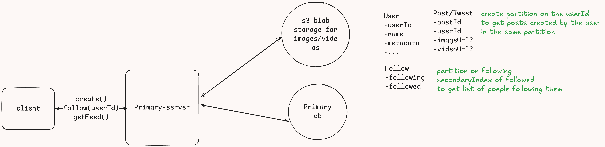

# Twitter/X like System design

Social Platform for creating posts of fixed size character lengths
## Scale

~1B Users with 100M DAU
1000:100 read to write ratio
 
## Functional
Post

View Feed

Follow People


## Non functional

Availability>> consistency

Availability in terms of feed, creation of post, and following of people

Eventual consistency of 1m for the new posts created

Scale to handle 100M DAU

## Core entities
Post

Follow

User

Feed (we may or may not need this as a entity)

## Api or interfaces
(assuming user is authenticated and the authentication information
is with the jwt token | session token)

Creating new post
```
POST /create/tweet -->200 response or the Post itself
body{
    text
    image?
    video?
}
```
follow
```
POST /follow/[userId] ---200 response
```
view feed
```
GET /feed ----> feeds:List<Feed>
```

## High level design

The image is self explanatory



## Deep dives
Twitter feed working is very similar to [Facebook News Feed](https://github.com/prashantRmishra/System-design/blob/main/facebook-news-feed/Readme.md#high-level-design)


## Out of scope functionalities
### Twitter search feature
- [This can be achieved using Elastic search](https://github.com/prashantRmishra/System-design/blob/main/elastic-search/readme.md)
  - [Example ticket master search feature](https://github.com/prashantRmishra/System-design/blob/main/ticket-master/Readme.md#improve-event-search-latency)
- [Create custom twitter search index](https://dev.to/prashantrmishra/design-search-feature-of-twitter-417p)