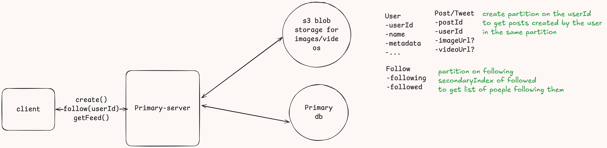

# Twitter/X like System design

## Functional requirements:
- Create account and login
- Create/edit/delete tweet
- Follow people
- Search tweet
- View Feed
- Like reply and retweet


## Non functional requirements
- Low latency search for tweet
- Handle high volume of reads/writes
- Handle 100 million daily active users
- Availability >> Consistency (eventual consistency with max delay of 500ms)
- Security and privacy of user data

## Core Entities
- Tweet
- User
- Follow
- Feed (optional we may not need)

## Api or interfaces

```
Authentication info in header: Session Token | JWT

// Creating/posting tweet
POST /tweet/ ----> Tweet or 200 http code
body{content}

// Deleting tweet
POST /tweet/{tweetId} ---> 200

// Liking tweet
POST /like/{tweet} ---> 200

// Replying tweet
POST /reply/{tweetId} ---> 200
body{content}

// Searching tweet
GET /search/?token={}?latitude={lat}?longitude={long} ---> PartialListOfTweets

// Follow
POST /follow ---> 200
body{userId //user that the current user wants to follow}

// View feed
GET /feed/?cursor={tweetId}?pageSize={pageSize}---> List<Tweet>

```
## High level design

The image is self explanatory


## Deep dives

### Low latency search for tweet
Achieved using Elastic search

### Handle high volume of reads/writes
Proper segregation of services depending on read or write heavy operation
- Tweet-Service
  - Creating/updating/delete/liking a tweet
- Reply-Service
  - Why separate reply service?
  - Performance:we can fetch tweets without fetching all the replies
  - Scalability: separating them from the Tweet-service allows us to scale this 
service independently 

### Handle 100 million daily active users
  - Autoscaling the microservices to handle read and write traffic
  - Feed table to handle asynchronous user feed update
### Availability >> Consistency (eventual consistency with max delay of 500ms)
  - DynamoDb for atomicity, asynchronous udpate of feed table to insure eventual consistency of feed 
### Security and privacy of user data
  - Data encryption in DynamoDb (at rest)
  - Https for in transit data encryption
  - Authentication service for authorization and authentication of users
  - Rate limiting (not included in the diagram) to insure no. of tweets allowed to be created per user in a given time period
  
Twitter feed working is very similar to [Facebook News Feed](https://github.com/prashantRmishra/System-design/blob/main/facebook-news-feed/Readme.md#high-level-design)

