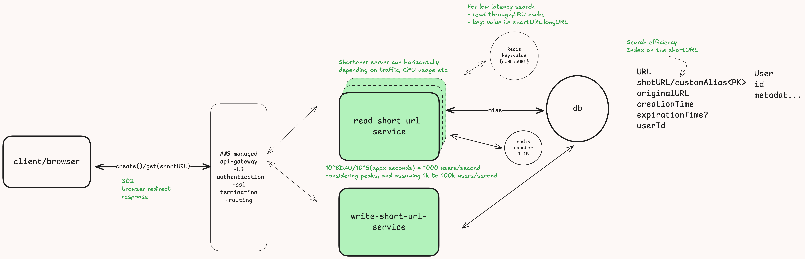

# Design URL shortener like bit.ly
---

**Bit.ly is a url shortener that shorts the given url into fixed size smaller urls**
***~1B urls = 10^9 urls stored***

- [Design URL shortener like bit.ly](#design-url-shortener-like-bitly)
  - [Requirements](#requirements)
    - [Functional requirements](#functional-requirements)
    - [Non functional requirements](#non-functional-requirements)
  - [Core entities](#core-entities)
  - [Api or interfaces](#api-or-interfaces)
  - [High Level Design](#high-level-design)
    - [Creating unique short URLs](#creating-unique-short-urls)
  - [Deep dives](#deep-dives)
    - [Low latency of url mapping](#low-latency-of-url-mapping)
      - [Redis cache](#redis-cache)
      - [CDN](#cdn)
    - [Scaling  and Availability](#scaling--and-availability)
      - [Scaling services](#scaling-services)
      - [Scaling db](#scaling-db)

## Requirements

### Functional requirements
- User should be able to create short url by providing original url
- The short url should navigate to the the same original url destination

### Non functional requirements
- Minimum latency i.e short url navigating to the destination same as the original url should have minimum latency
- Eventual consistency should be insured i.e it is not necessary for the new short urls to work immediately after they are created,
but they should work after few seconds like 5 or 10 seconds.
- Scale to handle 1B users
- Availability is preferred i.e. the url shortener server should be available at all times
- Short url should be of fixed length may be 6 character like bit.ly/ef34wQ ( covered in high level design)

## Core entities

URL i.e originalURL and shortURL
User

## Api or interfaces

creating short url

```
POST /create ---> shortURL
{
    originalURL
    alias?
    expirationTime?
}
```
Navigate to the destination given the sort URL

```
GET /[shortURL] ---> get the originalURL ---> navigate to the destination of the original url

302---redirect only
301---redirect with caching the response
We prefer to not use 301 as due to caching the response consecutive same request will be fulfilled from the cached response and we can loose significant analytics data
 
Analytics data like 
Which URls are hot?
Which URls are not being accessed at all?
or Similar such analytical info. on the accessed patterns of various short urls
```

## High Level Design


### Creating unique short URLs

-   **Using prefix of the long/originalURL**
    -   it is a bad idea, as a lot of urls might share the same prefix and we will end up creating shortURL that will be common for multiple long/original urls (not efficient at all and uniqueness is not ensured)
-   **Random number** 

    -   Creating random values for 10^9B urls = 10 chars(1 char for each 
digit), but this is more than 6 character, we need to compact this using some encoding like base62( 0-9,A-Z,a-z) = (10+26+26 = 62) now, each character has 62 possible values.
    - If each character in a word can be one of **62 possible values** (for example, 26 lowercase letters, 26 uppercase letters, and 10 digits), and you want to create a **6-character word**, the total number of unique combinations or permutations is \[62^6\]\[62^6 = 56,800,235,584 = 56 Billion(approx)\]
    - Issues: collision (duplicate random values)
    - Solution: we can check in db if the short url is already present before saving the short url, if present already we can recreate another random url
      - It wll create another round trip to db but will totally work
  - **Hash the long URL**
    - longURL -> md5(longURL) -> base62(hashvalue)-> slice the result and take only 6 character
    - This is will also work, but will have somewhat same collision rate as that of the random generator approach
  - **Counter**
    -   creating incremental values from 1 to 1B
        **base62** encode the counter it will never result in collision as we are continuously 
        incrementing the value.
    - Issue: predictability which bad for security
    - Solution: Bijective functions like (squids.org) that does one to one mapping of given int value to a unique string that looks exactly like the short urls we see on bit.ly or the string we get from the base62 encoding
  

## Deep dives




### Low latency of url mapping
By making shortUrl/customAlias a primary key we create an index on it automatically (true in most of the db system like postgres).

The index is kept in the memory (not always). We can think of this as a thing which is kept in-memory and acts as a pointer in the disk. So instead of going into the disk crawling through all the shortUrls we simple ask the index *where is this shortUrl?* and the index will point us directly to the 
disk location where the `shortUrl` is present as we can quickly get the corresponding `long/originalUrl`.

Postgres uses `B-tree` (balanced binary tree index) which has the search time of `log(n)`.

This one index should be enough as they are highly optimized for the searching.

*Issue*: We are still going to the disk to get the `longUrl`, well this is not a problem as SSDs now a days are very fast but we can definitely make this faster

*Solution*: By introducing cache before the database 

#### Redis cache
-  We can have read though,LRU cache, we will look into the redis cache first, if not present in the cache we will get the longUrl from the db and update the cache, this is called read-through
#### CDN
- While the above solution of using the cache will work the best, we can also think of using `CND` which will cache the results in various global edge server caches, So someone trying to access the `longURL` from India can quickly get it from the nearest `edge server` instead of going all the way to the original `shortener server` which is in different continent like California
- But this will have the same 301 redirect issue(as the result is cached and response is given from the cdn itself the actual server will loose the analytics data like *which url is being access how many time?*, *which is hot url?*, *which urls are not accessed at all?* and similar such analytics which might be very crucial for business standpoint)

### Scaling  and Availability

#### Scaling services

\[ 10^8DAU/ 10^5 (approx seconds) = 1000users/second\] 

Considering some peaks we can multiply this by `100` 1k to 100k users/per second

An average ec2 instance can handle on an average of 1000 requests/second ( this is reasonable enough assumption)
Since our application will be read heavy i.e most of the people will be accessing the short url rather that creating it.
By this understanding we can make some design changes in our system. like creating different service for read and create url ( this way we can scale then independently )

*note*: we can very well use only one service, instead of creating two different services for both reading and writing urls ( as there isn't much of a computation happening in both of them, hence creating different and managing different services here might be an overkill)

This autoscaling will also insure the high **availability** of the system

#### Scaling db
Let us say we have 500Bytes of data in each row * 1B rows = 500GB, which is not that much and can be stored in a single db server
as modern SSds have more than 1kTB of space 

*For fault tolerance*
- create read replicas

*To manage read/write load*
  - We have redis cache, we can also create shards (could 
be based on shortURL)
  - We can further create read replicas of
    the shards for availability and periodically take snapshot for the **availability**


    
