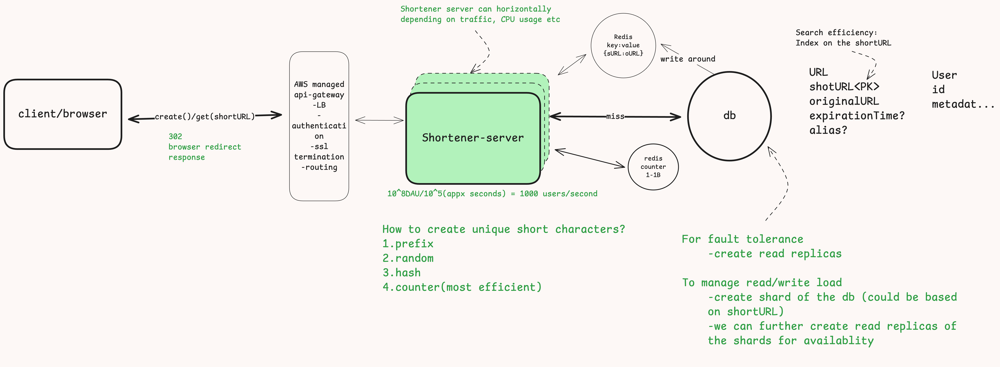

# Design URL shortener like bit.ly
---

**Bit.ly is a url shortener that shorts the given url into fixed size smaller urls**
***~1B urls = 10^9 urls stored***

- [Design URL shortener like bit.ly](#design-url-shortener-like-bitly)
  - [Requirements](#requirements)
    - [Functional requirements](#functional-requirements)
    - [Non functional requirements](#non-functional-requirements)
  - [Core entities](#core-entities)
  - [Api or interfaces](#api-or-interfaces)
  - [High Level Design](#high-level-design)
    - [Creating unique short URLs](#creating-unique-short-urls)
  - [Deep dives](#deep-dives)
  - [Low latency of url mapping](#low-latency-of-url-mapping)
  - [Scaling](#scaling)

## Requirements

### Functional requirements
User should be able to create short url by providing original url
the short url should navigate to the the same original url destination

### Non functional requirements
minimum latency i.e short url navigating to the destination same as the original url should have minimum latency
Availability is preferred i.e. the url shortener server should be available at all times
Eventual consistency should be insured i.e it is not necessary for the new short urls to work immediately after they are created,
but they should work after few seconds like 5 or 10 seconds.
Scale to handle 100M DAU 
short url should be of fixed length may be 6 character like bit.ly/ef34wQ

## Core entities

URL i.e originalURL and shortURL
User

## Api or interfaces

creating short url

```
POST /create ---> shortURL
{
    originalURL
    alias?
    expirationTime?
}
```
Navigate to the destination given the sort URL

```
GET /[shortURL] ---> get the originalURL ---> navigate to the destination of the original url

302---redirect with caching the response
301---redirect only
```

## High Level Design


### Creating unique short URLs

-   **Using prefix of the long/originalURL**
    -   it is a bad idea, as a lot of urls might share the same prefix and we will end up creating shortURL that will be common for multiple long/original urls (not efficient at all and uniqueness is not ensured)
-   **Random number** 

    -   Creating random values for 10^9B urls = 10 chars(1 char for each 
digit), but this is more than 6 character, we need to compact this using some encoding like base62( 0-9,A-Z,a-z) = (10+26+26 = 62) now, each character has 62 possible values.
    - If each character in a word can be one of **62 possible values** (for example, 26 lowercase letters, 26 uppercase letters, and 10 digits), and you want to create a **6-character word**, the total number of unique combinations or permutations is \[62^6\]\[62^6 = 56,800,235,584 = 56 Billion(approx)\]
    - Issues: collision (duplicate random values)
    - Solution: we can check in db if the short url is already present before saving the short url, if present already we can recreate another random url
      - It wll create another round trip to db but will totally work
  - **Hash the long URL**
    - longURL -> md5(longURL) -> base62(hashvalue)-> slice the result and take only 6 character
    - This is will also work, but will have somewhat same collision rate as that of the random generator approach
  - **Counter**
    -   creating incremental values from 1 to 1B
        **base62** encode the counter it will never result in collision as we are continuously 
        incrementing the value 

## Deep dives


## Low latency of url mapping

## Scaling 


https://youtu.be/iUU4O1sWtJA?t=2368
    
