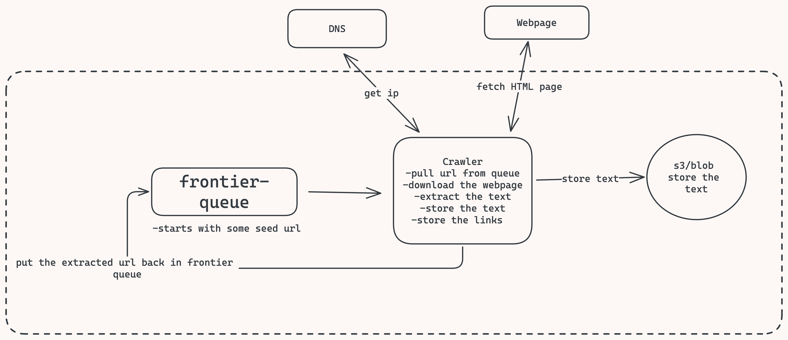
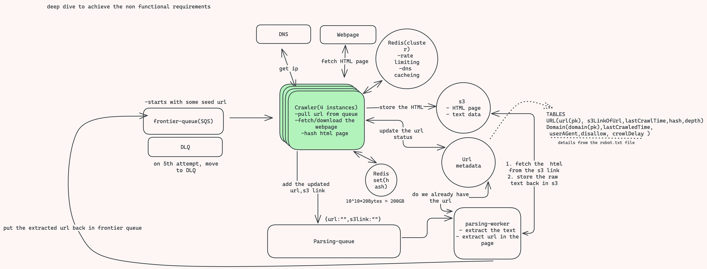

# Web crawler

Crawler is a program that searches the internet by downloading the pages going from one page to another page present as links within the pages recursively, this is mainly useful for creating indexes for search engines like google, bing, e.t.c.
It is also used for monitoring the changes in webpages, for collecting data for research/training LLM(large language models) like ChatGPT, bard, gemini etc.

---

**Road map to follow in any system design interview**

1. Requirements
2. Core-entities
3. Api or interface
4. Data flow
5. High-level design
6. Deep dive

**Primary goal 1-5**: satisfy functional requirements
**Primary goal 1-6**: satisfy Non-functional requirements

**Requirements**: functional(features)/non-functional(qualities/constraints of the system).

**Core-entities**: list of tables that you will have (don’t go deep dive in schema yet because initially we don’t know it, let the interviewer know you will comeback to it and fill out the full schema as and when you need to)
**Api or interface**: the input and output of the system ( apis are used for user facing apps, Interface is for non user facing programs like web-crawler).
**Data-flow**: How data is going to enumerate through the system.
**High-level design**: diagram that will full fill the functional requirements of the system.
Deep-dive: deep dive into the High level design and evolve it to satisfy the non-functional requirements of the system.

---

## Functional requirements:( expected to be given from the interviewer)
- crawl the full web starting from the given seed url
- extract text data and store

**Note: You can pause ask the interviewer about the scale of the system**
```
- 10B webpages
- 2MB each page size
- 5 days to scrape the web, etc.
- Limited/un-limited resource ?(meaning are we cost consensus, or we have huge budget)
```

## Non functional requirements:
- Fault tolerant
- Politeness(adhering to robot.txt in order to not overload the websites inappropriately)
- Scale to 10B webpages
- Efficiently crawl in under 5 days

## Core-Entities
*( are the data that your Api/interfaces are going to exchange and your system will persist in the data model)*
- Text data(output)
- Url metadata(metadata of the url like whether the url has been crawled or not)
- Domain metadata(domain metadata like policies in robot.txt and other details, So that we can adhere to those policies while visiting those websites/domains)


## Api design:
- **input**: input as seed webpages
- **output**: output is text contents/data


## Flow  of the web crawler:

1. Take the seed url from the frontier set and request the IP from the DNS (note: frontier set is the set of unvisited urls, seed url is the starting point for the web-crawler to begin exploring the website)
2. Fetch HTML/page
3. Extract text from HTML
4. Store the text in database
5. Extract url form the text and add to frontier
6. Repeat 1-5 until all the url’s have been crawled


## High level



**Basic flow**:
We will have a frontier queue that will have seed urls, the crawler will pull the seed url from the queue, query the DNS server to get the ip address, use that to fetch the webpage/html page, extract the text from the html page, store that text in blob storage like Amazon s3, store the links back in the frontier queue


## Deep dive



(***Deep dive to achieve the non-functional requirements of the system***)

First thing we note is the **crawler** service/server is doing a lot of task like 
- get url from frontier queue
- get ip by visited the domain of the url
- fetch the page/(HTML)
- extract text and extract url and put them back in frontier queue.

**What if any of the given tasks fails ?** we will loose all the progress done.
What is the issue here ? well there is not separation concern and it makes the monitoring bit tricky to track what stage are we on at any given moment.

**Solution** ? split them into multiple phases
- Fetch the HTML: web crawler will only get the url from the frontier queue and fetch the page from the web(finally store the web page/HTML back in s3 and update the **Url table** in  metadata db signifying the url has been visited)
- Parse the HTML page to store the text and extracted url ( the url visited will be added in the second queue called **parsing queue** from where the **parsing-worker** will read it and fetch the html page from the s3, and extract the text and put it back in s3 and update the frontier queue back again with the extracted url in the page)

#### Ensuring Fault tolerance(1st non functional requirement)

What if the crawler fails to fetch the webpage(very much possible), obvious thing to do is to **retry** after couple of seconds **by setting in-memory timer**.
What if the crawler goes down we will loose the in-memory timer as well, or what if the webpage is not ready even after couple of seconds (as per the in memory timer).
We need more sophisticated retry strategy like **exponential back off**, to introduce the exponential back off we need to introduce **State**.

**Using Kafka**:
We can manage this backoff in kafka itself if we assume that our frontier queue is kafka queue, but **kafka does not support retry on its own**, so we will have to write some sort of logic to achieve that.
We will create another topic in our frontier queue for those failed urls and in order to know how much to back off for each of them, we determine the backoff time at crawler and add that to the message that we put back in the queue, So when ever the new crawler pulls off of that topic, it will wait until that time before it tries to hit the same url again. **If it fails again the crawler has the logic to increase the wait time in exponential way** and put it back onto the failed topic.
This way if one crawler goes down another crawler can still pick the url from the topic and try again.

Note: *once the url is processed(taken out by crawler), it is not immediately removed from the queue, kafka maintain an offset for each entry(page-url in this case), once the url is taken out, processed and the page is stored in s3, then crawler can commit the offset back to kafka so that other crawler can know that the message has been processed, and then that message is committed and others won’t pull off that message. The message is only delete after some configurable retention policy.*

This approach is good but kind of mess, instead what we want to do is **we can use Amazon SQS as it supports retries with configurable exponential backoff out of the box**.

**Using AmazonSQS**:

So initially the messages that failed are retried once per **visibility timeout** ( default is 30 seconds)
**Visibility Timeout**: The period of time when other consumers are prevented from receiving and processing messages, so if the crawler pulled something off, the visibility time prevents anyone else from seeing it.
This visibility time increases exponentially with each retry attempt, after retry attempt it is put back on the queue with say visibility time of 30s, 2mins, 5mis, 15mis.
This solves needing us to implement this ourselves in kafka by just configuring in a configuration file with sqs.

We don’t want to retry indefinitely, maybe only 5 re-attempt, if the retry count is reached we would want to put the url in a Dead Letter Queue (DLD)
We can talk to the stakeholders like product team what do they want to do with webpages that are dead in DLQ as they are pretty much useless.
 
Note: **Don’t waste an exorbitant amount of time explaining these queues as they are very complex in there working and will consume a lot of time, so just touch point with them and move on.**


## Ensuring politeness(2nd non functional requirement):
**How do we adhere to the [robot.txt]((https://dev.to/prashantrmishra/common-terminology-in-system-design-1jhh#robottxt)) policies ?**

Anytime we visit a domain for the first time we wanna get its robot.txt file and then add additional state in url metadata db in table Domain.
For any of the subsequent crawls of the domain we first check if it is present in the Domain table to get the rules details.
For any given url we will check in the domain table, if this path is allowed (from the disallow column). If it is not allowed we will acknowledge the queue and the message/url will be deleted from the queue.
If now-lastCrawledTime > crawlDelay then we are allowed to crawl it else we will put the url back in queue and in case of sqs we will set that visibility timeout to what ever that crawl delay is.

**General [rate limiting]((https://dev.to/prashantrmishra/design-rate-limiter-42oc)) should be polite**:

Standard limit across the internet is you should not send more than 1 request per second. So you wanna make sure for any given domain you are not fetching it for more than 1/second.
We can use Redis for in-memory domain specific rate limiter, and we can use something like sliding window algorithm, that will count the no. of request made in the last second and make sure we are not exceeding the set limit.
So check rate limiter if we are allowed to make request if not put it back in the queue with some visibility timeout.

**Jitter**: It would be wise to add jitter
**Jitter is concept of adding some random time**, suppose we had 10 crawler having hitting the same domain and they all exceed the rate limiter and put back on the queue and they all get pulled off around the same time and they hit the rate limiter again and only one of them is allowed to go through and the process would repeat, so by introducing jitter we introduce some randomness and ensure that does not happen.


## Scale to 10B webpages(3rd non functional requirement)
Alway do scaling at the end to avoid potential bottleneck or change in the over all design of the system.
We have a strict requirements that we should be finished with crawling under 5 days. So how many crawlers we need to satisfy this requirement?
**Now we have a critical junction for which math will determine/influence direction, So we should do math at this point.**

In reality it would be difficult to estimate, so we want to do some testing and understand throughput, based on the test result we would multiply that out and determine the no. of machines we need.

We can mention above fact and then we can go ahead and make some crude estimations.

Top aws network optimized instances can handle 400Gbits/second of data.
Each page is of 2MB(mega bytes) on average (initial estimation)
```
So 400Gbits/8bits/Bytes/2MB per page = 25K pages/second on a single instance ( that is a lot, un-realistically insane)
```
The reality is we can never fully use the entire capacity of the instance as there are other factors as well like DNS, rate limiting, delayed response from webpages, crawl delay, retries, etc. which makes it impossible to maximize the total bandwidth.
Let’s assume we can only use ~30% of the total capacity/bandwidth of the instance.
```
Then 25Kpages*0.3 = approx. 10k pages per instance/second.
```
So How may days we will need to finish the task of processing/crawling 10B pages on a single instance (that can process 10k pages/second) ?
 
```
10^10/10^4 = 10^6 seconds = approx 10 days on a single machine.

So we will need 2 machines to finish the crawling in 5 days.
```
For buffer (if anything goes wrong in parser or in any other processing unit) we can assume 2*2 = 4 super duty network optimized AWS instances.

Parsing worker can be scaled dynamically as it is not a bottleneck, So depending on the no. of messages in the parsing queue we can spin up/down more/less instances of parsing-worker.

**Another potential bottleneck that is usually missed is DNS**
What if we are using 3rd party DNS provider, we wanna make sure we can handle this heavy load( of request/response to DNS server).
Most DNS providers have rate limiting that can be increased by throwing some more money(If it is not a constraint for the organization), but other optimization would be use DNS caching.
**Since we are already using redis for rate-limiting, we can use the same for DNS caching**, so for any domain we only have to hit the DNS server once and then we can cache those results and use that cache moving forward. This would significantly cut down the amount of request we make to  the DNS provider.
Another approach would be to **have multiple DNS provider and round robin the request between them**. This would help distribute the load between the multiple DNS providers, this would not only reduce the chance of hitting the rate limit( set by individual DNS providers) but also reduce the risk of any of those DNS providers having any issues.

## Ensuring efficiency(4th non functional requirement):

- We don’t wanna crawl the same url twice.
- We don’t want to parse a webpage that has duplicate content of a page that has already been parsed

**Avoid crawling same Url again**:

So don’t crawl url that has already been crawled. How ? simple thing we can do is before putting the url back in frontier queue right after parsing it(via parsing-worker), instead we would **query the metadata db(in table Url) to check if the url is already present**. In our current setup we only add the url in the Url table in metadata db only if it has been processed. If the url is not present in the Url table then we can put this url in frontier queue as well as we will put the url in Url table as well with **`lastCrawlTime: undefined`** (extra column **lastCrawlTime**, need to be added in the Url table in metadata db). And when the url is actually processed by the crawler by pulling it from the frontier queue, it can updated the lastCrawlTime, s3LinkOfUrl of the url in Url table as well which were undefined.

**Tip**: ***Sharding***: You can think of sharding the metadata db based on the url(primary key)

**Don’t parse duplicate contents**:

Chance are very high that some pages have duplicate contents hence they should not be parsed again and again.
What we can do is add additional functionality in the crawler server to hash the contents of the html page it downloads, **put the hash value in the Url table**, So when ever we download a new html page we hash it and check if it is already present in Url table of metadata db, if yes drop this page else put the s3 link of the page in parsing queue.

**How do we make this hashing efficient ?**
We can add Global Secondary Index(GSI) on the hash, now the hash check will become efficient with tc of **`O(logn)`**.
To reduce the call to the actual main db we can introduce a **in memory redis cache of redis set** and we can directly write/read hashes from the cache, this will improve performance.
note: this will introduce another layer of complexity like what if redis cache goes down, for this we can use **write back policy** and write hashes in batches in the main db in periodic interval.
This redis cache will have a lot of data(hash values) like **`10^10 Pages * 20bytes (for each hashvalue) = 200Gb`** of data (a single redis instance is fine, but if the memory is not a constraint we can think of having more instances, as of now 1 is fine)
So, this will reduce the tc: to **`O(1)`**, which was earlier `**O(logn)**`.


**How to handle crawler trap**?

These are pages that are designed to **keep crawler on the same site indefinitely** that can be created by having **pages that are linked to itself many times**, or it can link to a different page in the same domain over and over again nearly indefinitely with basically no content on the page. If we are not careful we will end up in infinite loop of recursive crawling pages.

**Solution** is we can implement some **max depth** for crawlers, like the max depth is 20 for any given url. We can add the same in the Url table of metadata db. So every time we follow a new link ( that we get via Parsing-worker) we can update the depth of the url by 1, and if the depth is more than the threshold we stop crawling.

---


**Tips**: 
If asked to introduce caching, we can add cache between the crawler server and the metadata db, but will add an extra cost, as we are already doing a lot of i/o operation like webpage fetch.

**Additional deep dives**:

- **Why did we not store the html file directly in the parsing queue** ?
This is because the queue size should be as minimum as possible, and we know the page size is 2MB, so it is better to store the s3 url of the page in queue and fetch the page using the s3link.

- **How visibility timeout works**?
  The entries/messages/url(in our case) is not deleted but made invisible to other crawlers when it is being processed by a crawler, So a crawler will pull the message from the message queue and let say the default visibility time is 30 seconds and if the crawler goes down then the message will only get visible once the 30s have elapsed. And it can be now pulled out by other crawlers. And if the crawler is successful in storing the HTML in s3 then it can issue command back to SQS to delete that message off of the queue.

- **How to handle dynamic content on the page**?
  The page content is not just html but loaded dynamically through java script, for this we will need a header less browser like puppeteer in the crawler that can render the javascript before we extract the page. This is going to make the crawler way slower, more error prune and way more expensive.

- **How to monitor health of the system**?
  You can have monitoring services like datadog, New relic.

- **How to handle large webpages**?
  Some webpages are huge may be we want them, may be not, we can use something like content length header on the requests to just skip downloading large files.

**What is global secondary index (GSI) **?
**What is Bloom filter **?

---


