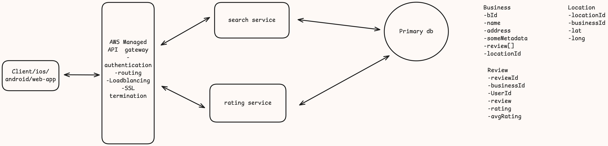
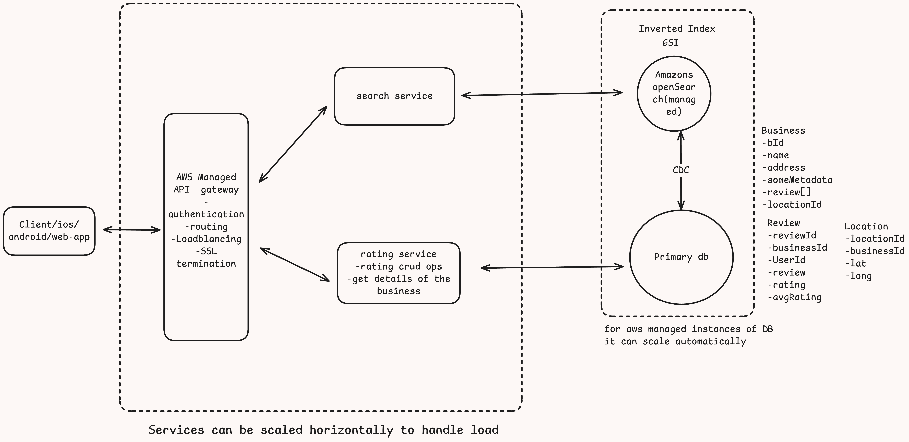

# Design yelp like system
Yelp is a web application/mobile application that allows users to find businesses online, view details of the business based on location and rate/review businesses.

- [Design yelp like system](#design-yelp-like-system)
  - [Requirements](#requirements)
  - [Core entities](#core-entities)
  - [Api or interface](#api-or-interface)
  - [High level design](#high-level-design)
  - [Deep Dives](#deep-dives)
    - [How to search efficiently?](#how-to-search-efficiently)
    - [How to insure Hight availability?](#how-to-insure-hight-availability)
    - [How to handle one user one review per business?](#how-to-handle-one-user-one-review-per-business)

## Requirements

functional:
User should be able to search for business <br>
User should be able to see details of the business <br>
User should be able to rate and review the business <br>


Non-functional:
Low search latency <br>
High availability of the business details  <br>
100M MAU, 10M businesses <br>
user to business rating/review 1:1 <br>

out of scope

GDPR compliance <br>
fault tolerance<br>

## Core entities
Business

Review

Location

User

## Api or interface

Search for a Business
```
GET /search/?term={term}?lat={lat}?long={long} > partial details of list of business

```
View Business
```
GET /business/[bId] > Business details with review skeleton and pagination
```
Review Business
```
POST /review > 200 (rating created )
{
    bId://
    rating://1-5
    review:// optional
}
```

## High level design



***search service***: self explanatory in the diagram

In summary search service returns list of businesses ( partial details like name, average rating of the business, etc)

***rating service*** 
review/rating created by the user(s) will be updated in the rating table.


## Deep Dives

### How to search efficiently?

For efficient searching we can use **elastic search database** that is optimized for searching, which is very efficient when the data is read heavy and does not change that often, since in yelp like system people will be reading(searching businesses and/or viewing details of the businesses) more than writing reviews (another write use case will be adding details of more businesses in the platform)
Elastic search can utilized [Inverted index](https://github.com/prashantRmishra/System-design/tree/main/elastic-search#how-documents-are-stored-inside-the-lucene-segments) and [doc value](https://github.com/prashantRmishra/System-design/tree/main/elastic-search#how-to-match-the-search-query) index for searching based on terms and it also supports GIS or Geo Spatial Index called [Geohashing](https://github.com/prashantRmishra/System-design/blob/main/important-concepts/PostGresPerformanceAndSearchLatencyForSpatialQueries.md#geohashing) which can also be used to optimize search results based on the `latitude` and `longitude`.

For updating the data in the elastic search (that needs to happen when ever there is some write in the actual data in the primary db) this change can be propagated in the elastic search db using **CDC**(Change Data Capture)

**Crude estimations**

*Writes*
```
10M businesses
Assuming 100M monthly active users
1000:1(read to write ration) then 0.1M users are writing review every months which is nothing but 3k review(writes) per day which is nothing
```
Storage estimation

```
We can assume modern aws managed postgresDb can store upto 100TB of data
If the each business details amounts to 2KB size the for 10M = 10M*2KB = 20GB(which is nothing entire business details can fit into a single DB).

Even if we multiple the 20GB by 10 (for rating/review data/metadata) i.e 20*10 = 200GB then also this is nothing.

We can create a copy/replica of the data for fault tolerance and availability
```


**How are we going to calculate average rating ?**

**Solution(s)**

- *Synchronous update(on the fly)*
Since there are not much of writes compared to reads so when ever review/rating are created at the same time average rating can also be calculated and updated in the `avgRating` column of `Rating` table.
we will need to columns for this `avgRating`, `totalCount`

    ```
    avgRating  = (totalCount*avgRating + newRating)/(totalCount + 1);
    also
    totalCount  = totalCount+1;

    ```
    Since we are getting `3k` write per month and an optimized instance of `postgresDB` can handle `4k` requests/second which is huge compared to monthly writes(hence we can calculate the average rating on the fly without affecting performance at all)


- *Crone Job(Asynchronous updated)*
If we decide to not updated the average rating on the fly( synchronously) then we can have something like a crone job that will run periodically and update the total count and average rating (asynchronously)

When clicked on one of the results then we fetch the details of the business  via rating service or business crud service


### How to insure Hight availability?
All the services (API gateway, search service, rating service) etc can be scaled horizontally depending on the traffic and surge of requests

### How to handle one user one review per business?
We can handle this in business logic itself, for any user writing the review for a business we can check if the rating for the given business already exists by the same user, if yes then we can display a proper message or error.

**Issues**
*What if a new team(say data engineering) is working on the different services(new) and they are kind of back filling the review and they are not aware of this business logic in the written in rating or crud service then how will we make sure 1:1 business to user rating?*

**Solution(s)**

*Database constraint*
In such case we can simply rely on the database validation constraint like we can keep userId unique for the given businessId

```
 UNIQUE (userID, businessID)
```
*Distributed lock*
We can use distributed lock like redis on the userId
Which ever service is writing the review first a distributed lock will be acquired on the userId So that no other service can use the same userId to write the review
later once the review has been created we can create a mapping in the redis using redis hashmap of userId and businessId (the same can also be persisted in the db)

So that any other service when try to write review at a later point of time with a userId(that has already been used to write review for the same business) we can quickly check if the userId is present in the cache or not if yes then error can be returned.


